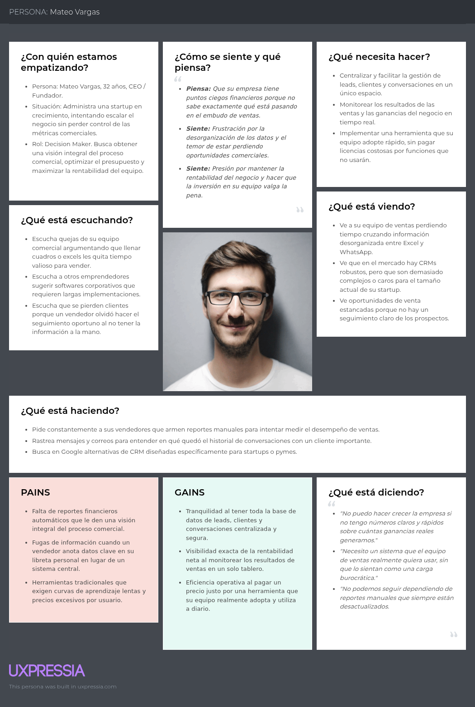

# Capítulo II: Requirements Elicitation & Analysis

## 2.1. Competidores

En esta sección se realiza la identificación y descripción de los principales competidores directos en el mercado de plataformas CRM para pequeñas y medianas empresas (pymes) y startups. Hemos identificado a tres plataformas consolidadas con ofertas similares al modelo de negocio de NovaLeads:

1. **Pipedrive:** Es un CRM de ventas diseñado por vendedores, altamente enfocado en la visualización del embudo (pipeline) y en la gestión de actividades diarias orientadas a cerrar tratos rápidamente.
2. **HubSpot CRM (Sales Hub):** Es una de las plataformas líderes en el mercado inbound, que ofrece un ecosistema integral para centralizar marketing, ventas y soporte al cliente, destacando por su amplia capa gratuita inicial.
3. **Freshsales (Freshworks):** Es una solución CRM orientada a ofrecer una visión 360° del ciclo de vida del prospecto, integrando comunicación multicanal (correo, chat, teléfono) y herramientas analíticas asistidas.

### 2.1.1. Análisis Competitivo

**Objetivo del análisis:** ¿Por qué llevar a cabo este análisis? El objetivo es identificar las fortalezas en experiencia de usuario y debilidades en escalabilidad de precios de los CRMs líderes del mercado, para posicionar a NovaLeads como la alternativa más intuitiva y transparente en costos para pymes y startups.

| Categoría | Criterio |    NovaLeads |    Pipedrive |    HubSpot CRM |    Freshsales |
| :--- | :--- | :--- | :--- | :--- | :--- |
| **Overview** | **Perfil** | Plataforma CRM integral orientada a centralizar la gestión de leads, conversaciones y ventas desde un único espacio para pymes y startups. | Plataforma CRM enfocada en la gestión visual del embudo de ventas y la automatización de flujos comerciales. | Solución integral que combina marketing, ventas y soporte con una amplia capa gratuita para adquisición masiva. | Solución CRM orientada al seguimiento multicanal y previsión de ingresos asistida por inteligencia de datos. |
| **Overview** | **Ventaja competitiva** | Simplicidad extrema y centralización total de conversaciones y ganancias sin configuraciones complejas ni módulos ocultos. | Interfaz altamente intuitiva basada en pipelines tipo Kanban enfocada en el cierre rápido de tratos. | Ecosistema robusto "todo en uno" (inbound) sin costo inicial de entrada. | Visión 360° del ciclo del prospecto integrando comunicación multicanal y analítica en un solo hilo. |
| **Marketing** | **Mercado objetivo** | Startups, pequeñas y medianas empresas (pymes), y equipos de ventas que buscan agilidad y orden rápido. | Pymes, startups en escalamiento y equipos B2B orientados a la acción. | Startups tempranas y agencias que necesitan escalar procesos completos de marketing y ventas. | Pymes con ciclos de prospección intensos que gestionan soporte y ventas omnicanal. |
| **Marketing** | **Estrategias de marketing** | Enfoque en la experiencia de usuario simple, demostraciones directas del ahorro de tiempo y planes accesibles. | Marketing de contenidos para vendedores, enfoque en productividad comercial y partnerships. | Inbound marketing masivo, certificaciones gratuitas (HubSpot Academy) y modelo freemium agresivo. | Posicionamiento competitivo en precio-valor, SEO comparativo y captación de usuarios descontentos con herramientas complejas. |
| **Productos & Servicios** | **Producto** | Dashboard unificado de leads, seguimiento de oportunidades, historial de conversaciones y monitorización de ganancias. | Gestión visual de embudos, buzón de ventas sincronizado, reportes de ingresos y automatizaciones comerciales. | Registro de leads, tablero de negocios, plantillas de correo y herramientas integradas de marketing/soporte. | Gestión de contactos, historial cronológico omnicanal, informes de ingresos y embudos asistidos. |
| **Productos & Servicios** | **Precios & Costos** | Planes SaaS por nivel: Básico (9 USD/mes), Medio (19 USD/mes) y Premium (39 USD/mes). Precios transparentes sin saltos abruptos al escalar. | Modelo SaaS por usuario desde aprox. $14 USD/mes, sin plan gratuito permanente. | Freemium (gratis base), pero los planes de pago presentan altos costos al escalar. | Nivel gratuito básico, planes de pago mensual por usuario desde aprox. $15 USD/mes. |
| **Canales de distribución** | **Web y/o Móvil** | Web y Móvil | Web y Móvil | Web y Móvil | Web y Móvil |
| **SWOT Análisis** | **Fortalezas** | Curva de aprendizaje casi nula, todo en una sola pantalla, ideal para adopción rápida por parte del equipo comercial. | Especialización absoluta en el vendedor y su productividad diaria. | Trazabilidad total del cliente desde que es lead hasta la post-venta. | Consolidación de todos los canales de comunicación (chat, email, teléfono) de forma nativa. |
| **SWOT Análisis** | **Debilidades** | Marca emergente con menor penetración inicial y falta de integraciones corporativas profundas (ERP). | Ausencia de capa gratuita y costos adicionales por funciones avanzadas de mensajería o automatización. | Curva de aprendizaje pesada, interfaz abrumadora y escalabilidad muy costosa para pymes. | Interfaz que puede resultar sobrecargada para equipos pequeños con necesidades directas de venta. |
| **SWOT Análisis** | **Oportunidades** | Captar a los usuarios frustrados por los altos costos de HubSpot y la complejidad de Freshsales o Salesforce. | Desarrollar soluciones específicas para microempresas o planes lite para captar la base baja del mercado. | Mejorar los precios de sus planes intermedios para retener a pymes en crecimiento que abandonan por costo. | Simplificar su UI/UX para competir mejor en el sector de las micro pymes. |
| **SWOT Análisis** | **Amenazas** | Equipos pequeños adoptando herramientas genéricas (Notion, Excel) en lugar de CRMs dedicados. | Pérdida de cuota ante herramientas CRM integradas por defecto en suites como Google Workspace o Microsoft 365. | CRMs de nicho más baratos y ágiles robando clientes maduros de su inmensa base freemium. | Alta rotación de usuarios si no perciben el valor real de sus herramientas analíticas frente al costo. |

### 2.1.2. Estratégias y tácticas frente a competidores

Desarrollar estrategias y tácticas efectivas para enfrentar a nuestros competidores requiere de un enfoque cuidadoso y planificado. A continuación se presentan las estrategias y tácticas diseñadas para NovaLeads con el fin de afrontar las fortalezas de la competencia y aprovechar sus debilidades en el mercado:

**Diferenciación por usabilidad y curva de aprendizaje cero:** A diferencia de competidores como HubSpot CRM o Freshsales, cuyas plataformas incluyen una multitud de funciones orientadas al marketing y soporte que terminan abrumando a los equipos comerciales, NovaLeads se enfoca estrictamente en la venta y el seguimiento. La táctica principal será ofrecer una interfaz minimalista donde la gestión de leads, el historial de conversaciones y el monitoreo de ganancias converjan en un solo espacio. Esto garantiza que el tiempo de capacitación del equipo de ventas se reduzca al mínimo, logrando una adopción inmediata de la herramienta y mitigando la amenaza del uso de hojas de Excel genéricas.

**Modelo de precios transparente y retención proactiva:**
Mientras que ecosistemas como HubSpot atrapan al usuario con planes gratuitos pero imponen costos prohibitivos al momento de escalar, o herramientas como Pipedrive cobran componentes adicionales (add-ons) por funcionalidades que deberían ser estándar, NovaLeads adoptará una estrategia de precios clara y predecible. La táctica consistirá en posicionarse como la alternativa justa para la pyme en crecimiento, ofreciendo planes escalables sin barreras ocultas, lo que capitalizará directamente la oportunidad del mercado de usuarios frustrados por saltos de tarifa abusivos de la competencia.

**Centralización enfocada en la conversación y la conversión:**
Nuestra táctica tecnológica y de producto frente a las plataformas altamente fragmentadas será mantener atado cada lead a su historial conversacional y a sus resultados financieros (ganancias) de forma indisoluble. Al posicionar el producto demostrando que un vendedor no necesita cambiar de pantalla (o módulo) para entender qué se habló con el cliente y cuánto dinero representa, NovaLeads aprovechará la debilidad de las interfaces sobrecargadas para establecerse como el estándar de agilidad y eficiencia operativa para startups.

## 2.2. Entrevistas

### 2.2.1. Diseño de entrevistas
Con el propósito de corroborar la viabilidad comercial de *NovaLeads, estructuramos una serie de sesiones de entrevistas enfocadas en nuestros dos públicos objetivos: **fundadores de negocios (startups y pymes)* y *fuerza de ventas*. Ambos perfiles lidian constantemente con el caos administrativo y la pérdida de oportunidades por no tener un sistema ordenado de seguimiento.

La finalidad principal de este levantamiento de información es analizar sus rutinas operativas vigentes, descubrir las fricciones que entorpecen su desempeño diario y medir qué tan dispuestos estarían a implementar una plataforma unificada que elimine la carga manual de sus procesos.

---
#### Segmento 1: Dueños de pymes y startups

> *Objetivo:* Comprender sus flujos de trabajo comerciales vigentes, descubrir qué barreras enfrentan al intentar calcular sus márgenes de ganancia y evaluar qué tan dispuestos estarían a usar un software que unifique el control de sus ventas.

**Cuestionario de validación:**

1. ¿Cuál es el principal canal que utiliza actualmente para captar nuevos leads o potenciales clientes?
2. ¿Cómo registra actualmente la información de sus leads y clientes?
3. ¿Qué información considera más importante conservar sobre un lead o cliente?
4. ¿Cómo realiza actualmente el seguimiento de los leads que todavía no han realizado una compra?
5. ¿Con qué frecuencia pierde el seguimiento de un lead o potencial cliente?
6. ¿Cuáles son las principales dificultades que encuentra al gestionar sus leads y clientes?
7. ¿Cómo administra actualmente las conversaciones que mantiene con sus clientes?
8. ¿Qué tan fácil le resulta conocer el estado de cada oportunidad de venta?
9. ¿Cómo realiza actualmente el seguimiento de sus ventas y ganancias?
10. ¿Qué problemas ha tenido por no contar con toda la información de sus clientes y oportunidades de venta centralizada en un solo lugar?
11. ¿Cuánto tiempo aproximadamente dedica semanalmente a organizar información de clientes, leads, conversaciones y ventas?
12. ¿Qué herramientas digitales utiliza actualmente para gestionar sus procesos comerciales?
13. ¿Qué características considera indispensables en una herramienta para administrar sus leads y clientes?
14. Si existiera una plataforma que permitiera gestionar leads, clientes, conversaciones y ganancias desde un mismo lugar, ¿qué tan útil sería para su negocio?
15. ¿Qué tendría que ofrecer una plataforma de este tipo para que usted considerara utilizarla en su negocio?

---

#### Segmento 2: Equipos de ventas

> *Objetivo:* Analizar el día a día de sus operaciones comerciales, detectar las molestias que causan las herramientas desintegradas y confirmar si características como un embudo visual aligerarían su carga laboral, garantizando así el cálculo de sus comisiones.

**Cuestionario de validación:**

1. ¿Cuántas personas forman parte actualmente de su equipo de ventas?
2. ¿Cómo registran y organizan actualmente los leads asignados a cada integrante del equipo?
3. ¿Qué herramientas utilizan para gestionar el proceso de ventas?
4. ¿Cómo realizan actualmente el seguimiento del estado de cada oportunidad de venta?
5. ¿Qué dificultades encuentran al distribuir o asignar leads entre los miembros del equipo?
6. ¿Con qué frecuencia un lead queda sin seguimiento o se pierde durante el proceso de venta?
7. ¿Cómo registran actualmente las conversaciones y comunicaciones que cada vendedor mantiene con los clientes?
8. ¿Qué tan fácil es para un vendedor conocer el historial de interacciones que otro miembro del equipo ha tenido con un cliente?
9. ¿Cómo supervisa actualmente el responsable del equipo el rendimiento de los vendedores?
10. ¿Qué indicadores utilizan para medir el desempeño del equipo de ventas?
11. ¿Qué dificultades tiene actualmente para obtener información sobre las ventas y ganancias del equipo?
12. ¿Cuánto tiempo dedica el equipo a actualizar registros, preparar reportes o buscar información sobre clientes y oportunidades?
13. ¿Qué funcionalidades considera más importantes para mejorar la gestión de su equipo de ventas?
14. Si existiera una plataforma que centralizara leads, clientes, conversaciones, oportunidades y resultados de ventas, ¿qué tan interesado estaría en utilizarla?
15. ¿Qué característica o problema debería resolver una plataforma de gestión de ventas para que su equipo realmente quisiera utilizarla?

### 2.2.2. Registro de entrevistas
En esta sección se consolidan las seis entrevistas realizadas para la validación de la propuesta de valor.

| Nombre del Entrevistado | Edad | Distrito | Segmento | Captura de Video | Enlace de la Entrevista (Stream) | Tiempo de Inicio | Tiempo de Fin | Duración |
| :--- | :---: | :--- | :--- | :---: | :--- | :---: | :---: | :---: |
|  | 19 | - | Dueño de Startup/Pyme |  | [Ver Video](https://upcedupe-my.sharepoint.com/:v:/g/personal/u202210735_upc_edu_pe/IQBUMHHviBCpS5wFct8YjKV7AceuYLoVE4QYPQgbMyiYfvk?e=qUNClh&nav=eyJyZWZlcnJhbEluZm8iOnsicmVmZXJyYWxBcHAiOiJTdHJlYW1XZWJBcHAiLCJyZWZlcnJhbFZpZXciOiJTaGFyZURpYWxvZy1MaW5rIiwicmVmZXJyYWxBcHBQbGF0Zm9ybSI6IldlYiIsInJlZmVycmFsTW9kZSI6InZpZXcifSwicGxheWJhY2tPcHRpb25zIjp7fX0%3D) | 00:00 | 05:05 | 05:05 |
| Jacob Rivera | 21 | - | Dueño de Startup/Pyme |  | [Ver Video](https://upcedupe-my.sharepoint.com/:v:/g/personal/u202210735_upc_edu_pe/IQBUMHHviBCpS5wFct8YjKV7AceuYLoVE4QYPQgbMyiYfvk?e=Kf929d&nav=eyJyZWZlcnJhbEluZm8iOnsicmVmZXJyYWxBcHAiOiJTdHJlYW1XZWJBcHAiLCJyZWZlcnJhbFZpZXciOiJTaGFyZURpYWxvZy1MaW5rIiwicmVmZXJyYWxBcHBQbGF0Zm9ybSI6IldlYiIsInJlZmVycmFsTW9kZSI6InZpZXcifSwicGxheWJhY2tPcHRpb25zIjp7InN0YXJ0VGltZUluU2Vjb25kcyI6MzA2LjR9fQ%3D%3D) | 05:05 | 10:38 | 05:32 |
| Dhilsen | 23 | Surco | Dueño de Startup/Pyme |  | [Ver Video](https://upcedupe-my.sharepoint.com/:v:/g/personal/u202210735_upc_edu_pe/IQBUMHHviBCpS5wFct8YjKV7AceuYLoVE4QYPQgbMyiYfvk?e=a2VWtu&nav=eyJyZWZlcnJhbEluZm8iOnsicmVmZXJyYWxBcHAiOiJTdHJlYW1XZWJBcHAiLCJyZWZlcnJhbFZpZXciOiJTaGFyZURpYWxvZy1MaW5rIiwicmVmZXJyYWxBcHBQbGF0Zm9ybSI6IldlYiIsInJlZmVycmFsTW9kZSI6InZpZXcifSwicGxheWJhY2tPcHRpb25zIjp7InN0YXJ0VGltZUluU2Vjb25kcyI6NjM5LjQ1fX0%3D) | 10:38 | 16:55 | 06:17 |
| Rogelio Nuñez | 19 | Santa Anita | Equipo de Ventas |  | [Ver Video](https://upcedupe-my.sharepoint.com/:v:/g/personal/u202210735_upc_edu_pe/IQBUMHHviBCpS5wFct8YjKV7AceuYLoVE4QYPQgbMyiYfvk?e=J1wKao&nav=eyJyZWZlcnJhbEluZm8iOnsicmVmZXJyYWxBcHAiOiJTdHJlYW1XZWJBcHAiLCJyZWZlcnJhbFZpZXciOiJTaGFyZURpYWxvZy1MaW5rIiwicmVmZXJyYWxBcHBQbGF0Zm9ybSI6IldlYiIsInJlZmVycmFsTW9kZSI6InZpZXcifSwicGxheWJhY2tPcHRpb25zIjp7InN0YXJ0VGltZUluU2Vjb25kcyI6MTAxNi45MX19) | 16:55 | 25:02 | 08:06 |
| Sebastián Herrera| 24 | Surquillo | Equipo de Ventas |  | [Ver Video](https://upcedupe-my.sharepoint.com/:v:/g/personal/u202210735_upc_edu_pe/IQBUMHHviBCpS5wFct8YjKV7AceuYLoVE4QYPQgbMyiYfvk?e=M2ATup&nav=eyJyZWZlcnJhbEluZm8iOnsicmVmZXJyYWxBcHAiOiJTdHJlYW1XZWJBcHAiLCJyZWZlcnJhbFZpZXciOiJTaGFyZURpYWxvZy1MaW5rIiwicmVmZXJyYWxBcHBQbGF0Zm9ybSI6IldlYiIsInJlZmVycmFsTW9kZSI6InZpZXcifSwicGxheWJhY2tPcHRpb25zIjp7InN0YXJ0VGltZUluU2Vjb25kcyI6MTUwNS4zOH19) | 25:02 | 29:00 | 03:57 |
| Rubi | - | - | Equipo de Ventas |  | [Ver Video](https://upcedupe-my.sharepoint.com/:v:/g/personal/u202210735_upc_edu_pe/IQBUMHHviBCpS5wFct8YjKV7AceuYLoVE4QYPQgbMyiYfvk?e=kxQRo2&nav=eyJyZWZlcnJhbEluZm8iOnsicmVmZXJyYWxBcHAiOiJTdHJlYW1XZWJBcHAiLCJyZWZlcnJhbFZpZXciOiJTaGFyZURpYWxvZy1MaW5rIiwicmVmZXJyYWxBcHBQbGF0Zm9ybSI6IldlYiIsInJlZmVycmFsTW9kZSI6InZpZXcifSwicGxheWJhY2tPcHRpb25zIjp7InN0YXJ0VGltZUluU2Vjb25kcyI6MTc0MC43M319) | 29:00 | 31:20 | 02:19 |
| Brenda | 24 | - | Equipo de Ventas |  | [Ver Video](https://upcedupe-my.sharepoint.com/:v:/g/personal/u202210735_upc_edu_pe/IQBUMHHviBCpS5wFct8YjKV7AceuYLoVE4QYPQgbMyiYfvk?e=eoIEh0&nav=eyJyZWZlcnJhbEluZm8iOnsicmVmZXJyYWxBcHAiOiJTdHJlYW1XZWJBcHAiLCJyZWZlcnJhbFZpZXciOiJTaGFyZURpYWxvZy1MaW5rIiwicmVmZXJyYWxBcHBQbGF0Zm9ybSI6IldlYiIsInJlZmVycmFsTW9kZSI6InZpZXcifSwicGxheWJhY2tPcHRpb25zIjp7InN0YXJ0VGltZUluU2Vjb25kcyI6MTg4Mi44M319) | 31:20 | 35:49 | 04:29 |

### 2.2.3. Análisis de entrevistas

A continuación, se presenta un análisis detallado de la sesión de validación. En este apartado se describen los comportamientos detectados, los puntos de dolor específicos, el contexto operativo y la recepción de la propuesta de valor de NovaLeads

#### Segmento 1: Dueños de startups y Pymes

**1. **

**2. Jacob Rivera**

**3. Dhilsen**
Dhilsen, de 23 años y residente en Surco, es dueño de una pyme o startup y capta principalmente nuevos leads mediante Instagram, WhatsApp y recomendaciones. Gestiona la información de sus clientes con Google Sheets; sin embargo, cuando tiene muchas consultas o pendientes, deja datos importantes en WhatsApp y puede olvidar registrarlos. Para él, es esencial conservar el nombre, datos de contacto, servicio solicitado, presupuesto, último contacto y etapa de venta de cada cliente, Su principal dificultad es que los datos, conversaciones y pagos se encuentran distribuidos entre WhatsApp, Instagram y hojas de cálculo. Esto ocasiona respuestas tardías, cotizaciones olvidadas y poca visibilidad sobre las oportunidades de ingreso futuras. Actualmente utiliza recordatorios del celular para hacer seguimiento, proceso que depende mucho de su memoria, y dedica entre tres y cuatro horas semanales a organizar la información. Dhilsen considera que NovaLeads sería útil si le permite centralizar clientes, conversaciones y ventas; registrar datos rápidamente; visualizar etapas comerciales; recibir recordatorios de seguimiento; y acceder desde el celular a un precio accesible.

#### Segmento 2: Equipos de Ventas

**4. Rogelio Nuñez**
Rogelio, de 19 años y residente en Santa Anita, forma parte de un equipo de ventas de cinco personas, compuesto por cuatro asesores y él como supervisor de las oportunidades comerciales. Tiene un enfoque organizado y orientado al control del rendimiento del equipo, pero actualmente depende de una hoja compartida, WhatsApp Business, correo electrónico y grupos internos para gestionar la información. Esta fragmentación provoca que los vendedores no siempre actualicen los datos a tiempo, dos personas contacten al mismo lead o algunos leads queden sin asignar.Además, el historial de conversaciones permanece en los WhatsApp individuales de los asesores, dificultando supervisar la atención y consolidar reportes. Rogelio dedica al menos cuatro horas semanales a revisar leads, cotizaciones, cierres y métricas como ventas cerradas, monto vendido y tiempo de respuesta. Considera valiosa una plataforma como NovaLeads si centraliza la asignación de leads, muestra al responsable y el estado de cada oportunidad, conserva un historial compartido y genera reportes claros. También espera poder utilizarla con rapidez tanto desde celular como computadora.

**5. Sebastián Herrera**

Sebastián es miembro de un equipo de ventas típico dentro de una pyme. De perfil pragmático, enfocado en resultados y motivado por sus comisiones, actualmente sobrevive operativamente utilizando una mezcla desorganizada de hojas de Excel, cruce de mensajes por WhatsApp y anotaciones en su cuaderno personal. Su mayor punto de dolor es la fragmentación de la información, lo cual le hace perder un tiempo valioso buscando qué le dijo a un cliente en interacciones pasadas y, en el peor de los casos, le hace perder comisiones por olvidar realizar seguimientos oportunos. Además, le genera una gran frustración tener que dedicar horas a llenar reportes manuales y poco fiables para su jefatura en lugar de enfocarse 100% en vender.
   
**6. Rubi**

Rubi es SDR dentro de un equipo de ventas dinámico donde los prospectos se atienden conforme van llegando, sin carteras fijas. De perfil enfocado en la productividad y motivada por aumentar sus comisiones, actualmente sobrevive operativamente utilizando una mezcla desorganizada de hojas de Google Sheets, la interfaz de WhatsApp Web y algunas notas rápidas en Notion. Su mayor punto de dolor es el trabajo manual excesivo, lo cual le hace perder hasta cuatro horas diarias copiando y pegando conversaciones de chat a su Excel y, en el peor de los casos, le hace perder ventas porque no logra dar seguimiento cuando los mensajes se entierran en el fondo de WhatsApp. Además, le genera una gran frustración trabajar sin un historial compartido, lo que provoca que ella y sus compañeras aborden accidentalmente al mismo cliente y dificulta cualquier reemplazo, deseando contar con una plataforma que guarde automáticamente los chats para poder enfocarse 100% en prospectar y comisionar.

**7. Brenda**

Brenda es una Ejecutiva Comercial que forma parte de un equipo de seis vendedores, donde cada uno gestiona su propia cartera segmentada por tipo de empresa. De perfil enfocado en cerrar contratos y asegurar sus comisiones, actualmente sobrevive operativamente saltando entre WhatsApp Business en un celular corporativo, un tablero de Trello adaptado como CRM y una hoja de Excel personal. Su mayor punto de dolor es la fragmentación de la información, lo cual le hace perder hasta seis horas semanales cuadrando datos manualmente para los reportes de su jefatura y, en el peor de los casos, provoca que ventas casi cerradas se enfríen porque los mensajes se pierden en el chat y olvida actualizar su tablero. Además, le genera una gran frustración la dependencia de dispositivos físicos; si debe cubrir a un compañero de vacaciones, necesita literalmente su teléfono corporativo para no trabajar a ciegas, por lo que considera indispensable una plataforma que unifique el embudo de ventas y el historial de chats en una sola pantalla.

#### Síntesis de hallazgos (Insights principales)

*   **El trabajo manual mata la productividad:** Tanto los SDRs como los Ejecutivos Comerciales pierden entre 3 y 6 horas a la semana copiando y pegando información de WhatsApp a Excel o Trello, tiempo que deberían invertir en vender.
*   **La fragmentación de herramientas enfría las ventas:** Al usar WhatsApp para chatear y otra herramienta separada para gestionar el embudo, los mensajes importantes se pierden en el fondo del chat y los clientes se quedan sin el seguimiento oportuno.
*   **La dependencia del dispositivo físico:** El historial de los clientes está secuestrado en los celulares o cuentas individuales de cada vendedor. Si alguien falta o se va de vacaciones, el equipo trabaja a ciegas porque carecen de un historial centralizado.
*   **Necesidad urgente de unificación:** La funcionalidad más esperada por todos los perfiles es tener el chat de WhatsApp y la información de la tarjeta del cliente (embudo) integrados en una sola pantalla compartida.

## 2.3. Needfinding
### 2.3.1. User Personas
En este apartado, detallaremos la metodología empleada para construir los perfiles clave de nuestros arquetipos de clientes (User Personas), incluyendo las visualizaciones finales generadas a través de la herramienta UXPressia.

Para estructurar estas fichas, adoptamos un enfoque estratégico poniendo al usuario en el centro del análisis, basándonos directamente en los hallazgos de las entrevistas previas. El equipo debatió y sintetizó las características de cada segmento para completar los distintos cuadrantes, definiendo variables esenciales: demografía, nivel de habilidades técnicas y comerciales, contexto diario (background), objetivos principales, frustraciones, motivaciones, y los canales digitales que más utilizan.

Como resultado de este ejercicio, conseguimos humanizar a nuestros segmentos objetivo. Esto nos permitió comprender a fondo sus mayores preocupaciones, las soluciones operativas que demandan y, de manera crucial, los factores que los convencerían de que NovaLeads es la plataforma indicada para centralizar y facilitar la gestión de leads, clientes, conversaciones y ganancias, eliminando la fricción administrativa.

#### A. User Persona: Mateo Vargas (Segmento Dueños de Startups)
Este perfil refleja la realidad directiva de Mateo, evidenciando su urgencia por obtener visibilidad en tiempo real sobre el desempeño de las ventas. Asimismo, subraya su frustración ante un entorno de datos desorganizados y herramientas dispersas que le bloquean la posibilidad de medir la rentabilidad financiera y tener un panorama completo del proceso comercial de su equipo.

#### B. User Persona: Valeria Torres (Segmento Equipos de Ventas)
Este perfil refleja la realidad operativa de Valeria, evidenciando su necesidad de contar con una herramienta de ventas ágil que potencie su trabajo en lugar de frenarlo. Asimismo, subraya su frustración frente a las tareas administrativas repetitivas y sistemas lentos que le quitan tiempo valioso para prospectar, dificultando el seguimiento de sus clientes y el logro de sus comisiones mensuales.

### 2.3.2. User Task Matrix
En esta sección se presenta la matriz de tareas que concentra las actividades que los User Persona que representan a cada segmento (Mateo Vargas y Valeria Torres) realizan para cumplir sus objetivos, independientemente de la existencia de la solución de software propuesta

| User Task Matrix | Valeria Torres (Frecuencia) | Valeria Torres (Importancia) | Mateo Vargas (Frecuencia) | Mateo Vargas (Importancia) |
| :--- | :---: | :---: | :---: | :---: |
| Registrar datos de contacto de nuevos prospectos (leads) | 3 | 3 | 1 | 2 |
| Realizar llamadas, correos o mensajes de seguimiento | 3 | 3 | 1 | 1 |
| Registrar el historial de conversaciones y acuerdos | 3 | 3 | 1 | 2 |
| Agendar reuniones o demostraciones de producto | 3 | 3 | 2 | 2 |
| Asignar y distribuir leads a los miembros del equipo | 1 | 1 | 3 | 3 |
| Calcular y registrar el valor monetario de los tratos | 2 | 3 | 3 | 3 |
| Revisar el estado general del embudo de ventas | 2 | 2 | 3 | 3 |
| Generar reportes de rentabilidad y desempeño del equipo | 1 | 1 | 3 | 3 |
| Proyectar ingresos mensuales y metas comerciales | 1 | 1 | 2 | 3 |

**Leyenda:**
* **Frecuencia:** 1 (Baja), 2 (Media), 3 (Alta).
* **Importancia:** 1 (Baja), 2 (Media), 3 (Alta).

A partir de la matriz de tareas, se observa que las tareas con mayor frecuencia e importancia para Valeria Torres (Ejecutiva de Ventas) son puramente operativas y de contacto directo, como el registro de leads, los seguimientos y la documentación del historial de conversaciones. Por otro lado, Mateo Vargas (Dueño de Startup) prioriza tareas analíticas y estratégicas con alta frecuencia e importancia, destacando la revisión del embudo de ventas, el cálculo del valor monetario de los tratos y la generación de reportes de rentabilidad. La coincidencia principal entre ambos perfiles recae en la alta importancia que le otorgan al cálculo de los tratos monetarios, ya que impacta directamente en las comisiones de Valeria y en la rentabilidad general que busca Mateo. La principal diferencia radica en la ejecución diaria: mientras Valeria interactúa con el cliente, Mateo supervisa el rendimiento global del equipo.

### 2.3.3. User Journey Mapping

En este apartado se exponen los **User Journey Maps (As-Is)** diseñados para los dos arquetipos fundamentales de nuestro proyecto: Mateo Vargas (CEO / Dueño de Startup) y Valeria Torres (Ejecutiva de Ventas B2B).

El propósito de estas representaciones visuales es trazar el *end-to-end journey* del escenario actual que viven ambos usuarios al administrar sus operaciones comerciales **sin el respaldo de un CRM centralizado como NovaLeads** para gestionar clientes, prospectos e interacciones. Los gráficos exponen los flujos de trabajo tradicionales, abarcando desde la carga operativa diaria por ingresar contactos, hasta la constante lucha gerencial por supervisar las ganancias y los resultados de las ventas.

Al analizar estos recorridos, logramos detectar los momentos críticos de fricción (*pain points*), los declives en la experiencia y las principales frustraciones, fundamentando así la pertinencia de construir nuestra solución tecnológica. Cada recorrido se encuentra enlazado a su correspondiente **User Persona**, modelado previamente en la herramienta UXPressia.

#### A. User Journey Map: Mateo Vargas (Segmento Dueños de Startups)
Este diagrama describe la rutina directiva de Mateo, quien hoy en día está atado a hojas de cálculo fragmentadas y reportes manuales para evaluar el desempeño de sus vendedores. El mapa refleja su estrés por la carencia de indicadores exactos del embudo de ventas, la pérdida de datos clave por la desorganización general y la enorme fricción que supone intentar visualizar la rentabilidad de su negocio al instante.

#### B. User Journey Map: Valeria Torres (Segmento Equipos de Ventas)
Este trayecto detalla las actividades cotidianas de Valeria en el ámbito comercial. Su recorrido "As-Is" evidencia cómo el ingreso de datos de prospectos se ve obstaculizado por herramientas lentas y llenas de burocracia. Esto le provoca fatiga administrativa, dispersión en los historiales de conversaciones y el peligro inminente de olvidar hacer retornos de llamada esenciales, lo cual perjudica directamente sus metas y comisiones.

### 2.3.4. Empathy Mapping

En este apartado, detallaremos la metodología empleada para construir los mapas de empatía de nuestros perfiles clave (User Personas), incluyendo las visualizaciones finales generadas a través de la herramienta UXPressia.

Para estructurar estos diagramas, adoptamos un enfoque estratégico poniendo al usuario en el centro del análisis. El equipo debatió y sintetizó las características de cada arquetipo para completar los distintos cuadrantes, dando respuesta a interrogantes esenciales del modelo: ¿A quién estamos estudiando?, ¿Cuáles son sus tareas a resolver?, ¿Qué expresa verbalmente?, ¿Qué observa en su entorno comercial?, ¿Qué acciones toma?, ¿Qué comentarios escucha de terceros? y ¿Cuáles son sus verdaderos pensamientos y emociones?

Como resultado de este ejercicio, conseguimos extraer los **Pains** (obstáculos, temores y frustraciones) y los **Gains** (expectativas, motivaciones y alegrías) de cada segmento. Esto nos permitió comprender a fondo sus mayores preocupaciones, las soluciones operativas que demandan y, de manera crucial, los factores que los convencerían de que NovaLeads es el CRM indicado para centralizar y facilitar la gestión de leads, clientes, conversaciones y ganancias.

#### A. Empathy Map: Mateo Vargas (Segmento Dueños de Startups)
Este diagrama refleja la realidad directiva de Mateo, evidenciando su urgencia por obtener visibilidad en tiempo real sobre el desempeño de las ventas. Asimismo, subraya su frustración ante un entorno de datos desorganizados que le bloquea la posibilidad de medir la rentabilidad financiera y tener un panorama completo del proceso comercial.

#### B. Empathy Map: Valeria Torres (Segmento Equipos de Ventas)
El presente mapa profundiza en la jornada operativa de Valeria, destacando su prioridad por organizar prospectos y hacer avanzar oportunidades de venta de la manera más rápida posible. Además, expone su rechazo hacia los sistemas lentos y manuales que dispersan la información, causándole el temor constante de olvidar seguimientos importantes y, como consecuencia, perder sus comisiones mensuales.

## 2.4. Big Picture Event Storming

## 2.5. Ubiquitous Language
