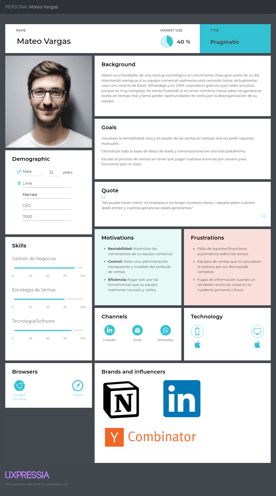
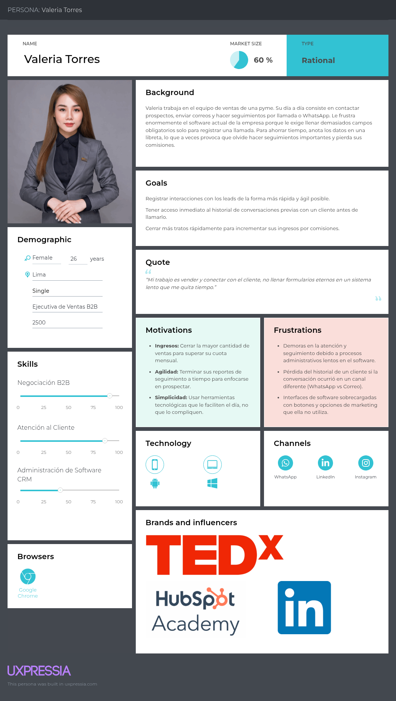

# Capítulo II: Requirements Elicitation & Analysis

## 2.1. Competidores

### 2.1.1. Análisis Competitivo

### 2.1.2. Estratégias y tácticas frente a competidores

## 2.2. Entrevistas

### 2.2.1. Diseño de entrevistas
Con el propósito de corroborar la viabilidad comercial de *NovaLeads, estructuramos una serie de sesiones de entrevistas enfocadas en nuestros dos públicos objetivos: **fundadores de negocios (startups y pymes)* y *fuerza de ventas*. Ambos perfiles lidian constantemente con el caos administrativo y la pérdida de oportunidades por no tener un sistema ordenado de seguimiento.

La finalidad principal de este levantamiento de información es analizar sus rutinas operativas vigentes, descubrir las fricciones que entorpecen su desempeño diario y medir qué tan dispuestos estarían a implementar una plataforma unificada que elimine la carga manual de sus procesos.

---
#### Segmento 1: Dueños de pymes y startups

> *Objetivo:* Comprender sus flujos de trabajo comerciales vigentes, descubrir qué barreras enfrentan al intentar calcular sus márgenes de ganancia y evaluar qué tan dispuestos estarían a usar un software que unifique el control de sus ventas.

**Cuestionario de validación:**

1. ¿Cuál es el principal canal que utiliza actualmente para captar nuevos leads o potenciales clientes?
2. ¿Cómo registra actualmente la información de sus leads y clientes?
3. ¿Qué información considera más importante conservar sobre un lead o cliente?
4. ¿Cómo realiza actualmente el seguimiento de los leads que todavía no han realizado una compra?
5. ¿Con qué frecuencia pierde el seguimiento de un lead o potencial cliente?
6. ¿Cuáles son las principales dificultades que encuentra al gestionar sus leads y clientes?
7. ¿Cómo administra actualmente las conversaciones que mantiene con sus clientes?
8. ¿Qué tan fácil le resulta conocer el estado de cada oportunidad de venta?
9. ¿Cómo realiza actualmente el seguimiento de sus ventas y ganancias?
10. ¿Qué problemas ha tenido por no contar con toda la información de sus clientes y oportunidades de venta centralizada en un solo lugar?
11. ¿Cuánto tiempo aproximadamente dedica semanalmente a organizar información de clientes, leads, conversaciones y ventas?
12. ¿Qué herramientas digitales utiliza actualmente para gestionar sus procesos comerciales?
13. ¿Qué características considera indispensables en una herramienta para administrar sus leads y clientes?
14. Si existiera una plataforma que permitiera gestionar leads, clientes, conversaciones y ganancias desde un mismo lugar, ¿qué tan útil sería para su negocio?
15. ¿Qué tendría que ofrecer una plataforma de este tipo para que usted considerara utilizarla en su negocio?

---

#### Segmento 2: Equipos de ventas

> *Objetivo:* Analizar el día a día de sus operaciones comerciales, detectar las molestias que causan las herramientas desintegradas y confirmar si características como un embudo visual aligerarían su carga laboral, garantizando así el cálculo de sus comisiones.

**Cuestionario de validación:**

1. ¿Cuántas personas forman parte actualmente de su equipo de ventas?
2. ¿Cómo registran y organizan actualmente los leads asignados a cada integrante del equipo?
3. ¿Qué herramientas utilizan para gestionar el proceso de ventas?
4. ¿Cómo realizan actualmente el seguimiento del estado de cada oportunidad de venta?
5. ¿Qué dificultades encuentran al distribuir o asignar leads entre los miembros del equipo?
6. ¿Con qué frecuencia un lead queda sin seguimiento o se pierde durante el proceso de venta?
7. ¿Cómo registran actualmente las conversaciones y comunicaciones que cada vendedor mantiene con los clientes?
8. ¿Qué tan fácil es para un vendedor conocer el historial de interacciones que otro miembro del equipo ha tenido con un cliente?
9. ¿Cómo supervisa actualmente el responsable del equipo el rendimiento de los vendedores?
10. ¿Qué indicadores utilizan para medir el desempeño del equipo de ventas?
11. ¿Qué dificultades tiene actualmente para obtener información sobre las ventas y ganancias del equipo?
12. ¿Cuánto tiempo dedica el equipo a actualizar registros, preparar reportes o buscar información sobre clientes y oportunidades?
13. ¿Qué funcionalidades considera más importantes para mejorar la gestión de su equipo de ventas?
14. Si existiera una plataforma que centralizara leads, clientes, conversaciones, oportunidades y resultados de ventas, ¿qué tan interesado estaría en utilizarla?
15. ¿Qué característica o problema debería resolver una plataforma de gestión de ventas para que su equipo realmente quisiera utilizarla?

### 2.2.2. Registro de entrevistas
En esta sección se consolidan las seis entrevistas realizadas para la validación de la propuesta de valor.

| Nombre del Entrevistado | Edad | Distrito | Segmento | Captura de Video | Enlace de la Entrevista (Stream) | Tiempo de Inicio | Tiempo de Fin | Duración |
| :--- | :---: | :--- | :--- | :---: | :--- | :---: | :---: | :---: |
|  | 19 | - | Dueño de Startup/Pyme |  | [Ver Video](https://upcedupe-my.sharepoint.com/:v:/g/personal/u202210735_upc_edu_pe/IQBUMHHviBCpS5wFct8YjKV7AceuYLoVE4QYPQgbMyiYfvk?e=qUNClh&nav=eyJyZWZlcnJhbEluZm8iOnsicmVmZXJyYWxBcHAiOiJTdHJlYW1XZWJBcHAiLCJyZWZlcnJhbFZpZXciOiJTaGFyZURpYWxvZy1MaW5rIiwicmVmZXJyYWxBcHBQbGF0Zm9ybSI6IldlYiIsInJlZmVycmFsTW9kZSI6InZpZXcifSwicGxheWJhY2tPcHRpb25zIjp7fX0%3D) | 00:00 | 05:05 | 05:05 |
| Jacob Rivera | 21 | - | Dueño de Startup/Pyme |  | [Ver Video](https://upcedupe-my.sharepoint.com/:v:/g/personal/u202210735_upc_edu_pe/IQBUMHHviBCpS5wFct8YjKV7AceuYLoVE4QYPQgbMyiYfvk?e=Kf929d&nav=eyJyZWZlcnJhbEluZm8iOnsicmVmZXJyYWxBcHAiOiJTdHJlYW1XZWJBcHAiLCJyZWZlcnJhbFZpZXciOiJTaGFyZURpYWxvZy1MaW5rIiwicmVmZXJyYWxBcHBQbGF0Zm9ybSI6IldlYiIsInJlZmVycmFsTW9kZSI6InZpZXcifSwicGxheWJhY2tPcHRpb25zIjp7InN0YXJ0VGltZUluU2Vjb25kcyI6MzA2LjR9fQ%3D%3D) | 05:05 | 10:38 | 05:32 |
| Dhilsen | - | - | Dueño de Startup/Pyme |  | [Ver Video](https://upcedupe-my.sharepoint.com/:v:/g/personal/u202210735_upc_edu_pe/IQBUMHHviBCpS5wFct8YjKV7AceuYLoVE4QYPQgbMyiYfvk?e=a2VWtu&nav=eyJyZWZlcnJhbEluZm8iOnsicmVmZXJyYWxBcHAiOiJTdHJlYW1XZWJBcHAiLCJyZWZlcnJhbFZpZXciOiJTaGFyZURpYWxvZy1MaW5rIiwicmVmZXJyYWxBcHBQbGF0Zm9ybSI6IldlYiIsInJlZmVycmFsTW9kZSI6InZpZXcifSwicGxheWJhY2tPcHRpb25zIjp7InN0YXJ0VGltZUluU2Vjb25kcyI6NjM5LjQ1fX0%3D) | 10:38 | 16:55 | 06:17 |
| Rogelio Nuñez | - | - | Equipo de Ventas |  | [Ver Video](https://upcedupe-my.sharepoint.com/:v:/g/personal/u202210735_upc_edu_pe/IQBUMHHviBCpS5wFct8YjKV7AceuYLoVE4QYPQgbMyiYfvk?e=J1wKao&nav=eyJyZWZlcnJhbEluZm8iOnsicmVmZXJyYWxBcHAiOiJTdHJlYW1XZWJBcHAiLCJyZWZlcnJhbFZpZXciOiJTaGFyZURpYWxvZy1MaW5rIiwicmVmZXJyYWxBcHBQbGF0Zm9ybSI6IldlYiIsInJlZmVycmFsTW9kZSI6InZpZXcifSwicGxheWJhY2tPcHRpb25zIjp7InN0YXJ0VGltZUluU2Vjb25kcyI6MTAxNi45MX19) | 16:55 | 25:02 | 08:06 |
| Sebastián Herrera| 24 | Surquillo | Equipo de Ventas |  | [Ver Video](https://upcedupe-my.sharepoint.com/:v:/g/personal/u202210735_upc_edu_pe/IQBUMHHviBCpS5wFct8YjKV7AceuYLoVE4QYPQgbMyiYfvk?e=M2ATup&nav=eyJyZWZlcnJhbEluZm8iOnsicmVmZXJyYWxBcHAiOiJTdHJlYW1XZWJBcHAiLCJyZWZlcnJhbFZpZXciOiJTaGFyZURpYWxvZy1MaW5rIiwicmVmZXJyYWxBcHBQbGF0Zm9ybSI6IldlYiIsInJlZmVycmFsTW9kZSI6InZpZXcifSwicGxheWJhY2tPcHRpb25zIjp7InN0YXJ0VGltZUluU2Vjb25kcyI6MTUwNS4zOH19) | 25:02 | 29:00 | 03:57 |
| Rubi | - | - | Equipo de Ventas |  | [Ver Video](https://upcedupe-my.sharepoint.com/:v:/g/personal/u202210735_upc_edu_pe/IQBUMHHviBCpS5wFct8YjKV7AceuYLoVE4QYPQgbMyiYfvk?e=kxQRo2&nav=eyJyZWZlcnJhbEluZm8iOnsicmVmZXJyYWxBcHAiOiJTdHJlYW1XZWJBcHAiLCJyZWZlcnJhbFZpZXciOiJTaGFyZURpYWxvZy1MaW5rIiwicmVmZXJyYWxBcHBQbGF0Zm9ybSI6IldlYiIsInJlZmVycmFsTW9kZSI6InZpZXcifSwicGxheWJhY2tPcHRpb25zIjp7InN0YXJ0VGltZUluU2Vjb25kcyI6MTc0MC43M319) | 29:00 | 31:20 | 02:19 |
| Brenda | 24 | - | Equipo de Ventas |  | [Ver Video](https://upcedupe-my.sharepoint.com/:v:/g/personal/u202210735_upc_edu_pe/IQBUMHHviBCpS5wFct8YjKV7AceuYLoVE4QYPQgbMyiYfvk?e=eoIEh0&nav=eyJyZWZlcnJhbEluZm8iOnsicmVmZXJyYWxBcHAiOiJTdHJlYW1XZWJBcHAiLCJyZWZlcnJhbFZpZXciOiJTaGFyZURpYWxvZy1MaW5rIiwicmVmZXJyYWxBcHBQbGF0Zm9ybSI6IldlYiIsInJlZmVycmFsTW9kZSI6InZpZXcifSwicGxheWJhY2tPcHRpb25zIjp7InN0YXJ0VGltZUluU2Vjb25kcyI6MTg4Mi44M319) | 31:20 | 35:49 | 04:29 |

### 2.2.3. Análisis de entrevistas

A continuación, se presenta un análisis detallado de la sesión de validación. En este apartado se describen los comportamientos detectados, los puntos de dolor específicos, el contexto operativo y la recepción de la propuesta de valor de NovaLeads

#### Segmento 1: Dueños de startups y Pymes

**1. **

**2. Jacob Rivera**

**3. Dhilsen**

#### Segmento 2: Equipos de Ventas

**4. Rogelio Nuñez**

**5. Sebastián Herrera**

Sebastián es miembro de un equipo de ventas típico dentro de una pyme. De perfil pragmático, enfocado en resultados y motivado por sus comisiones, actualmente sobrevive operativamente utilizando una mezcla desorganizada de hojas de Excel, cruce de mensajes por WhatsApp y anotaciones en su cuaderno personal. Su mayor punto de dolor es la fragmentación de la información, lo cual le hace perder un tiempo valioso buscando qué le dijo a un cliente en interacciones pasadas y, en el peor de los casos, le hace perder comisiones por olvidar realizar seguimientos oportunos. Además, le genera una gran frustración tener que dedicar horas a llenar reportes manuales y poco fiables para su jefatura en lugar de enfocarse 100% en vender.
   
**6. Rubi**
   
**7. Brenda**

#### Síntesis de hallazgos (Insights principales)

---

## 2.3. Needfinding
### 2.3.1. User Personas
En este apartado, detallaremos la metodología empleada para construir los perfiles clave de nuestros arquetipos de clientes (User Personas), incluyendo las visualizaciones finales generadas a través de la herramienta UXPressia.

Para estructurar estas fichas, adoptamos un enfoque estratégico poniendo al usuario en el centro del análisis, basándonos directamente en los hallazgos de las entrevistas previas. El equipo debatió y sintetizó las características de cada segmento para completar los distintos cuadrantes, definiendo variables esenciales: demografía, nivel de habilidades técnicas y comerciales, contexto diario (background), objetivos principales, frustraciones, motivaciones, y los canales digitales que más utilizan.

Como resultado de este ejercicio, conseguimos humanizar a nuestros segmentos objetivo. Esto nos permitió comprender a fondo sus mayores preocupaciones, las soluciones operativas que demandan y, de manera crucial, los factores que los convencerían de que NovaLeads es la plataforma indicada para centralizar y facilitar la gestión de leads, clientes, conversaciones y ganancias, eliminando la fricción administrativa.

#### A. User Persona: Mateo Vargas (Segmento Dueños de Startups)
Este perfil refleja la realidad directiva de Mateo, evidenciando su urgencia por obtener visibilidad en tiempo real sobre el desempeño de las ventas. Asimismo, subraya su frustración ante un entorno de datos desorganizados y herramientas dispersas que le bloquean la posibilidad de medir la rentabilidad financiera y tener un panorama completo del proceso comercial de su equipo.

#### B. User Persona: Valeria Torres (Segmento Equipos de Ventas)
Este perfil refleja la realidad operativa de Valeria, evidenciando su necesidad de contar con una herramienta de ventas ágil que potencie su trabajo en lugar de frenarlo. Asimismo, subraya su frustración frente a las tareas administrativas repetitivas y sistemas lentos que le quitan tiempo valioso para prospectar, dificultando el seguimiento de sus clientes y el logro de sus comisiones mensuales.

### 2.3.2. User Task Matrix
En esta sección se presenta la matriz de tareas que concentra las actividades que los User Persona que representan a cada segmento (Mateo Vargas y Valeria Torres) realizan para cumplir sus objetivos, independientemente de la existencia de la solución de software propuesta

| User Task Matrix | Valeria Torres (Frecuencia) | Valeria Torres (Importancia) | Mateo Vargas (Frecuencia) | Mateo Vargas (Importancia) |
| :--- | :---: | :---: | :---: | :---: |
| Registrar datos de contacto de nuevos prospectos (leads) | 3 | 3 | 1 | 2 |
| Realizar llamadas, correos o mensajes de seguimiento | 3 | 3 | 1 | 1 |
| Registrar el historial de conversaciones y acuerdos | 3 | 3 | 1 | 2 |
| Agendar reuniones o demostraciones de producto | 3 | 3 | 2 | 2 |
| Asignar y distribuir leads a los miembros del equipo | 1 | 1 | 3 | 3 |
| Calcular y registrar el valor monetario de los tratos | 2 | 3 | 3 | 3 |
| Revisar el estado general del embudo de ventas | 2 | 2 | 3 | 3 |
| Generar reportes de rentabilidad y desempeño del equipo | 1 | 1 | 3 | 3 |
| Proyectar ingresos mensuales y metas comerciales | 1 | 1 | 2 | 3 |

**Leyenda:**
* **Frecuencia:** 1 (Baja), 2 (Media), 3 (Alta).
* **Importancia:** 1 (Baja), 2 (Media), 3 (Alta).

A partir de la matriz de tareas, se observa que las tareas con mayor frecuencia e importancia para Valeria Torres (Ejecutiva de Ventas) son puramente operativas y de contacto directo, como el registro de leads, los seguimientos y la documentación del historial de conversaciones. Por otro lado, Mateo Vargas (Dueño de Startup) prioriza tareas analíticas y estratégicas con alta frecuencia e importancia, destacando la revisión del embudo de ventas, el cálculo del valor monetario de los tratos y la generación de reportes de rentabilidad. La coincidencia principal entre ambos perfiles recae en la alta importancia que le otorgan al cálculo de los tratos monetarios, ya que impacta directamente en las comisiones de Valeria y en la rentabilidad general que busca Mateo. La principal diferencia radica en la ejecución diaria: mientras Valeria interactúa con el cliente, Mateo supervisa el rendimiento global del equipo.

### 2.3.3. User Journey Mapping

### 2.3.4. Empathy Mapping

En este apartado, detallaremos la metodología empleada para construir los mapas de empatía de nuestros perfiles clave (User Personas), incluyendo las visualizaciones finales generadas a través de la herramienta UXPressia.

Para estructurar estos diagramas, adoptamos un enfoque estratégico poniendo al usuario en el centro del análisis. El equipo debatió y sintetizó las características de cada arquetipo para completar los distintos cuadrantes, dando respuesta a interrogantes esenciales del modelo: ¿A quién estamos estudiando?, ¿Cuáles son sus tareas a resolver?, ¿Qué expresa verbalmente?, ¿Qué observa en su entorno comercial?, ¿Qué acciones toma?, ¿Qué comentarios escucha de terceros? y ¿Cuáles son sus verdaderos pensamientos y emociones?

Como resultado de este ejercicio, conseguimos extraer los **Pains** (obstáculos, temores y frustraciones) y los **Gains** (expectativas, motivaciones y alegrías) de cada segmento. Esto nos permitió comprender a fondo sus mayores preocupaciones, las soluciones operativas que demandan y, de manera crucial, los factores que los convencerían de que NovaLeads es el CRM indicado para centralizar y facilitar la gestión de leads, clientes, conversaciones y ganancias.

#### A. Empathy Map: Mateo Vargas (Segmento Dueños de Startups)
Este diagrama refleja la realidad directiva de Mateo, evidenciando su urgencia por obtener visibilidad en tiempo real sobre el desempeño de las ventas. Asimismo, subraya su frustración ante un entorno de datos desorganizados que le bloquea la posibilidad de medir la rentabilidad financiera y tener un panorama completo del proceso comercial.

#### B. Empathy Map: Valeria Torres (Segmento Equipos de Ventas)
El presente mapa profundiza en la jornada operativa de Valeria, destacando su prioridad por organizar prospectos y hacer avanzar oportunidades de venta de la manera más rápida posible. Además, expone su rechazo hacia los sistemas lentos y manuales que dispersan la información, causándole el temor constante de olvidar seguimientos importantes y, como consecuencia, perder sus comisiones mensuales.

## 2.4. Big Picture Event Storming

## 2.5. Ubiquitous Language
