# Capítulo V: Product Implementation, Validation & Deployment.

## 5.1. Software Configuration Management

### 5.1.1. Software Development Environment Configuration

**Project Management:**

La gestión de los proyectos tiene como objetivo mejorar los procesos y su entorno para alcanzar los resultados esperados, facilitando la colaboración continua del equipo.

* **WhatsApp:** Canal de mensajería instantánea empleado para la comunicación síncrona, permitiendo consultas rápidas, toma de decisiones ágiles y una interacción constante entre los miembros del equipo de desarrollo.
* **Google Meet:** Plataforma de videoconferencia elegida como el espacio principal para llevar a cabo las reuniones periódicas (como los Daily Stand-ups), compartir pantalla en tiempo real y solucionar bloqueos técnicos de forma conjunta.

**Product UX/UI Design & Architecture:**

Nos permite desarrollar el modelo de nuestro producto de manera digital para que forme parte de la vida del consumidor. En este caso, realizar esquemas, diagramas de arquitectura y el diseño visual para computadoras y celulares.

* **UXPressia:** Herramienta en línea especializada en la gestión de requerimientos y diseño centrado en el usuario. Sus funcionalidades nos permitieron establecer las bases analíticas mediante la creación de User Personas, Empathy Maps y Journey Maps.
* **Figma:** Plataforma colaborativa de diseño de interfaces web, empleada para elaborar los esquemas estructurales (wireframes), las maquetas visuales (mock-ups) y los prototipos interactivos de alta fidelidad para el Landing Page y las aplicaciones.
* **Miro:** Es una pizarra digital interactiva en línea, utilizada para la investigación temprana, la ideación y la creación de lluvias de ideas.
* **PlantUML:** Herramienta de modelado bajo el enfoque *Diagram-as-Code*, utilizada para estructurar y documentar de manera programática la arquitectura del sistema y los diagramas de clases.
* **Trello:** Herramienta de gestión visual basada en tableros Kanban. Se ha adaptado en este contexto para organizar y hacer un seguimiento detallado de las tareas específicas correspondientes al diseño de experiencia de usuario y arquitectura.

**Software Development:**

Representa el marco metodológico y técnico empleado para la construcción del producto. Esta estructura define los procesos y actividades específicas que guían el ciclo de vida del desarrollo, asegurando un enfoque organizado para cada etapa de la implementación técnica.

* **GitHub:** Plataforma central de alojamiento que facilita el control de versiones distribuido y la gestión colaborativa de todo el código fuente del proyecto.
* **HTML:** Lenguaje de marcado estándar utilizado para definir la estructura semántica y el esqueleto del contenido de nuestras páginas web.
* **CSS:** Lenguaje de hojas de estilo encargado de la presentación visual, garantizando la estética, la adaptación responsiva en múltiples dispositivos y las animaciones de la interfaz.
* **JavaScript:** Lenguaje de programación empleado para dotar de interactividad dinámica al lado del cliente, gestionar eventos y aplicar la lógica de internacionalización en las vistas.
* **Vue.js:** Framework progresivo de JavaScript, seleccionado para la construcción robusta, ágil y basada en componentes de la aplicación web Frontend.
* **ASP.NET Core (C#):** Framework utilizado para el desarrollo del RESTful API y la gestión centralizada de la lógica de negocio, conexiones y servicios en el Backend.
* **MySQL Workbench:** Herramienta de software visual enfocada en el diseño, modelado y administración directa de las bases de datos relacionales requeridas por el sistema.

**Software Testing:**

Es el acto de examinar los artefactos y el comportamiento del software bajo prueba mediante procesos sistemáticos de validación y verificación.

* **Lenguaje Gherkin:** Es un DSL o Lenguaje Específico de Dominio creado para describir comportamientos del sistema de manera comprensible. Se utiliza para estructurar las historias de usuario y sus criterios de aceptación mediante la sintaxis: Feature, Scenario, Given, When, Then y And.

### 5.1.2. Source Code Management

En esta sección se presenta la gestión de código fuente o como es conocido por sus siglas en inglés SCM (Source Code Management). Su función principal es realizar un seguimiento de las modificaciones que el equipo realizará a lo largo del desarrollo de sus proyectos en los repositorios de código fuente. Se emplea como un sistema de control de versiones que permite dar seguimiento a los cambios que cada integrante o desarrollador realice en el proyecto. Asimismo, cabe resaltar que para el sistema de control de versiones emplearemos GitHub.

**Organización de Repositorios**

Para mantener la modularidad, el proyecto está dividido en repositorios independientes gestionados por la organización principal en GitHub.

* **Organización en GitHub (NovaScale):**

| **URL:** | https://github.com/202620-1asi0730-8074-novascale |
| :--- | :--- |

* **Repositorio del Landing Page:**

| **URL:** | https://github.com/202620-1asi0730-8074-novascale/novascale-website |
| :--- | :--- |

* **Repositorio del Frontend:**

| **URL:** | https://github.com/202620-1asi0730-8074-novascale/novascale-webapp |
| :--- | :--- |

* **Repositorio del Backend:**

| **URL:** | https://github.com/202620-1asi0730-8074-novascale/novascale-platform |
| :--- | :--- |

**GitFlow**

Es el modelo alternativo de creación de ramas en Git que en los últimos años se ha vuelto una herramienta indispensable para muchos desarrolladores. Este flujo de trabajo de control de versiones utiliza ramas y fue publicado y popularizado por Vincent Driessen. Su principal función es ayudar en la organización de la versión de un código, permitiendo la creación de nuevos Features y Hotfixes de manera organizada.

**Main Branches:**

* **main:** Es la rama principal de producción. A partir de ella se recorrerán todas las ramas y contendrá la última versión de código estable y las anteriores versiones definitivas creadas por los desarrolladores.
* **develop:** Esta rama de integración se crea a partir de la rama main y contará con todos los Features estables. Esto significa que a través de esta rama el equipo podrá integrar y probar las nuevas funciones de manera unificada.

**Support Branches:**

* **feature:** Se ramifica de develop y al finalizar el desarrollo debe fusionarse de nuevo obligatoriamente en develop. Se emplea para desarrollar historias de usuario individuales o nuevas funciones que se integrarán en versiones posteriores.
* **release:** También se ramifica de develop. Es la rama que admite la preparación, revisión final y estabilización de una nueva versión antes de su salida a producción.
* **hotfix:** Está destinada a corregir fallos en una nueva versión de producción, pero esta se ramifica directamente de main. Su función es reparar rápidamente emergencias o publicaciones de producción críticas sin alterar el trabajo en progreso.

**Conventional Commits:**

Son una convención estándar y obligatoria para nombrar los mensajes de commit en Git de forma estructurada, clara y semántica, facilitando la lectura del historial.

* **feat:** Se añade una nueva funcionalidad al software.
* **fix:** Se corrige un error de código o fallo en el sistema.
* **docs:** Cambios o agregados realizados exclusivamente en la documentación del proyecto.
* **style:** Cambios de formato o estilo de código (como puntos y comas, indentaciones) sin impacto en la lógica.
* **refactor:** Mejoras en la estructura del código que no añaden nuevas funcionalidades ni corrigen errores, pero optimizan el rendimiento o la lectura.
* **test:** Añadir nuevos escenarios de prueba o modificar tests existentes.
* **chore:** Cambios menores sin impacto en el código de producción (por ejemplo, actualización de dependencias, configuración de entornos, etc.).

### 5.1.3. Source Code Style Guide & Conventions

Para asegurar un código fácil de mantener, escalable y que favorezca el trabajo en equipo dentro del proyecto **NovaLeads** (nuestro CRM diseñado para pymes y startups), en NovaScale hemos establecido normativas de programación basadas en estándares globales. Una regla inquebrantable de este proyecto es que **todos los elementos del código fuente** (como nombres de variables, clases, métodos, ramas y comentarios) deben escribirse exclusivamente en **inglés**.

#### A. HTML5, CSS3 & JavaScript (Landing Page)
Para la creación de nuestra página web promocional, la cual se encuentra en el repositorio `novascale-website`, seguimos los lineamientos de la *Google HTML/CSS Style Guide* y las normativas de la *W3C*:

*   **HTML5:** Uso riguroso de etiquetas con valor semántico (`<header>`, `<section>`, `<article>`) para organizar visualmente los beneficios del CRM, aplicando siempre una indentación de 2 espacios.
*   **CSS3:** Adopción del patrón **BEM** (Block Element Modifier) utilizando la escritura en *kebab-case* para nombrar las clases de estilo (ej. `.pricing-card__button--active`).
*   **JavaScript:** Las interacciones del lado del cliente se rigen por las *MDN JavaScript Guidelines*, declarando funciones y variables en formato `camelCase`.

#### B. Vue.js & PrimeVue (Frontend Web Application)
El desarrollo de la plataforma web principal, enfocada en la gestión de los equipos de ventas y alojada en `novascale-webapp`, obedece al *Vue Style Guide* y se apoya en el sistema visual *Material Design* provisto por **PrimeVue**:

*   **Componentes (SFC):** Todo *Single-File Component* (`.vue`) debe nombrarse usando `PascalCase` y su título debe reflejar claramente su propósito en el sistema (ej. `LeadKanbanBoard.vue`, `SalesDashboard.vue`).
*   **Lógica y Variables:** Las propiedades reactivas y los métodos de JavaScript se redactan obligatoriamente en `camelCase`.
*   **Directivas:** Es imperativo usar la sintaxis abreviada de Vue (ej. `:` en lugar de `v-bind` y `@` en lugar de `v-on`) para garantizar que las plantillas sean fáciles de leer.

#### C. C# & ASP.NET Core (Backend - Iteraciones Futuras)
La arquitectura de nuestros Web Services RESTful, ubicados en el repositorio `novascale-platform`, se rige por las *Microsoft C# Coding Conventions* y las mejores prácticas de *ASP.NET Core*:

*   **Clases y Métodos:** Se exige el formato `PascalCase` para su declaración (ej. `LeadManagementController`).
*   **Interfaces:** Toda interfaz de dominio o técnica debe iniciar con la letra "I" mayúscula (ej. `IConversationService`).
*   **Variables Locales y Parámetros:** Se declaran utilizando `camelCase`.
*   **Estructura:** Implementamos *Entity Framework Core* como ORM para sincronizar con la base de datos previamente modelada en **MySQL Workbench**, y utilizamos XML Documentation (`///`) para describir el comportamiento de los endpoints.

#### D. Gherkin (Readable Specifications)
Los criterios de aceptación de nuestras Historias de Usuario se redactan bajo la estructura de **Gherkin** (`Given-When-Then`). Esta práctica certifica que el comportamiento esperado de la plataforma sea perfectamente comprensible para cualquier *stakeholder*, asegurando que cada función desarrollada mitigue los problemas de organización del equipo comercial.

### 5.1.4. Software Deployment Configuration

El ciclo de integración y entrega continua (CI/CD) de **NovaLeads** está completamente gestionado mediante **GitHub Actions**. Este mecanismo nos permite automatizar las validaciones y la publicación de código nuevo en la rama `main` (respetando nuestra metodología GitFlow), asegurando entregas rápidas y seguras.

Puesto que la meta principal de nuestra iteración actual (Sprint 1) fue cimentar la presencia operativa del producto a través de la Landing Page, nuestro pipeline de despliegue automatiza actualmente la salida a producción de las interfaces de usuario. Esto deja el terreno y la infraestructura en la nube preparados para conectar la lógica del backend en las fases posteriores.

#### Ecosistema de Despliegue

| Componente | Entorno de Hosting | Tecnologías y Estrategia de Despliegue |
| :--- | :--- | :--- |
| **Landing Page** | GitHub Pages | Servicio de alojamiento de sitios estáticos para el repositorio `novascale-website`. Se apoya en la CDN global de GitHub para brindar tiempos de respuesta óptimos, habiéndose desplegado de forma exitosa en el Sprint 1. |
| **Frontend Web App** | Amazon S3 & CloudFront | Distribución de los archivos compilados (`dist/`) de nuestra aplicación Vue alojada en `novascale-webapp`. CloudFront funciona como red de distribución de contenido (CDN) para el almacenamiento en caché y la administración de los certificados SSL. |
| **Web Services (Próximos Sprints)** | AWS Elastic Beanstalk | Plataforma como Servicio (PaaS) encargada de hospedar nuestra API RESTful programada en C# (`novascale-platform`), la cual cuenta con balanceo dinámico de carga. |
| **Database (Próximos Sprints)** | Amazon RDS | Motor de base de datos relacional MySQL (estructurado desde MySQL Workbench) y administrado en la nube de AWS. Cuenta con backups automatizados para proteger la información comercial. |

#### Pipeline de Despliegue (Pasos del CI/CD)

1. **Desarrollo y Testing Local:** Los programadores comprueban el correcto funcionamiento de los componentes en Vue y el diseño de la Landing Page directamente en sus equipos locales, verificando que el código cumpla con las directrices de estilo.
2. **Control de Versiones (GitFlow):** El código nuevo se envía (`git push`) a una rama de trabajo específica (`feature/*`). Posteriormente, se abre un *Pull Request* hacia la rama de integración `develop`, redactando los mensajes bajo la norma de *Conventional Commits*.
3. **Integración Continua (CI):** La creación de un *Pull Request* activa inmediatamente un *workflow* de GitHub Actions encargado de descargar las dependencias (`npm install`) y compilar la aplicación. Cualquier fallo en este proceso bloquea automáticamente la fusión del código.
4. **Despliegue Continuo (Frontend):** Una vez que el PR es revisado y fusionado hasta la rama `main`, GitHub Actions mueve los archivos finales de la Landing Page hacia la rama `gh-pages`. Al mismo tiempo, los binarios de la aplicación Web se cargan en el *bucket* de Amazon S3 y se ejecuta una invalidación de caché en CloudFront.
5. **Despliegue Backend (Futuro):** En los próximos sprints, el pipeline empaquetará la solución en C# (`dotnet publish`) y mandará los ejecutables hacia AWS Elastic Beanstalk, estableciendo finalmente la conexión con la base de datos Amazon RDS.

## 5.2. Landing Page, Services & Applications Implementation
En esta sección se detalla y evidencia el proceso continuo de implementación, pruebas de software, documentación técnica y despliegue en la nube de los componentes de la solución: Landing Page, RESTful Web Services y Frontend Web Applications. 
A partir de la priorización establecida en el Product Backlog, el desarrollo se ha estructurado mediante iteraciones ágiles, garantizando que tanto los procesos *core* del negocio como los procesos de soporte sean construidos y desplegados progresivamente aplicando principios de *Responsive Web Design*.

### 5.2.1. Sprint 1
En esta sección se registra y explica el avance obtenido durante el primer ciclo de desarrollo (Sprint 1), abarcando tanto la construcción de los productos de software iniciales como el trabajo colaborativo del equipo. Se incluyen los detalles de planificación, los líderes de cada aspecto, el backlog comprometido y las evidencias de ejecución, documentación y despliegue del trabajo completado.

#### 5.2.1.1. Sprint Planning 1
El Sprint Planning Meeting marcó el inicio formal del desarrollo. Durante esta sesión, se seleccionaron las Historias de Usuario más prioritarias del Product Backlog para definir el objetivo central de la iteración. A continuación, se presenta el cuadro resumen con los detalles y acuerdos de esta reunión:

| **Sprint #** | Sprint 1 |
| :--- | :--- |
| **Sprint Planning Background** | |
| **Date** | 2026-08-26 |
| **Time** | 21:00 PM |
| **Location** | Reunión virtual (Google Meet) |
| **Prepared By** | Bottger Salazar, Johan Karl |
| **Attendees (to planning meeting)** | Johan, Renzo, Sergio, Lui, Dario |
| **Sprint n – 1 Review Summary** | - |
| **Sprint n – 1 Retrospective Summary** | - |
| **Sprint Goal & User Stories** | |
| **Sprint 1 Goal** | **Contexto:** El equipo decidió enfocar el primer esfuerzo de codificación en sentar las bases operativas de la plataforma, desarrollando la Landing Page para presentar el producto.    **Sprint Goal:** *"Our focus is on offering a reliable body of knowledge for future users of our CRM system, while establishing the product's digital presence through a responsive Landing Page.* *We believe it delivers a trustworthy onboarding experience to administrators and clear product value proposition to prospective customers.* *This will be confirmed when administrators and visitors can navigate the Landing Page features without errors."* |
| **Sprint 1 Velocity** | 67 Story Points. (Velocidad estimada basada en la capacidad inicial del equipo para configurar los entornos). |
| **Sum of Story Points** | 67 Story Points. |

#### 5.2.1.2. Aspect Leaders and Collaborators

En esta sección se presenta la **Leadership-and-Collaboration Matrix (LACX)**. Esta matriz detalla los líderes (L) y colaboradores (C) para cada aspecto clave del Sprint, asegurando una comunicación clara y una distribución de responsabilidades eficiente para el proyecto. La organización está directamente relacionada con la selección de tareas (*tasks*) que se desarrollarán durante el Sprint.

| Team Member (First Name, Last Name) | GitHub Username | Arquitectura & DB | Backend API & Seguridad | Frontend (Landing & Web App) | QA & Deployment |
| :--- | :--- | :---: | :---: | :---: | :---: |
| Lui Mathias Gamero Miranda | lug07m | L | C | C | C |
| Dario Alberto Romero Vilela | patatitis9-alt | C | L | C | C |
| Johan Karl Bottger Salazar | Deskjobo | C | C | L | C |
| Sergio Ruben Caldas Garcia | Sergiocaldas10 | C | C | C | L |
| Renzo Paul Retuerto Zapata | Renzoocf | C | C | C | C |

#### 5.2.1.3. Sprint Backlog 1
Durante el primer sprint, el equipo se centró en desarrollar una landing page que fuera tanto atractiva como funcional, organizando y distribuyendo tareas en el tablero de Sprint de acuerdo con las habilidades de cada integrante.

##### **Sprint 1 - Tareas Asignadas**

| **User Story** |  | **Work-Item / Task** |  |  |  |  |  |
| :--- | :--- | :--- | :--- | :--- | :--- | :--- | :--- |
| **Id** | **Título** | **Id** | **Título** | **Descripción** | **Est. (Hrs)** | **Asignado** | **Status** |
| US-21 | Visualización de información del negocio | T-01 | Diseñar estructura de la Landing Page | Definir la estructura de las secciones principales y organizar la información de NovaLeads. | 3 | Lui | To Do |
| US-21 | Visualización de información del negocio | T-02 | Implementar información del negocio | Implementar las secciones principales con la propuesta de valor, funcionalidades y beneficios de NovaLeads. | 5 | Lui | To Do |
| US-22 | Información para dueños de pymes y startups | T-03 | Diseñar sección para dueños | Definir la estructura y contenido de la sección dirigida a dueños de pymes y startups. | 3 | Dario | To Do |
| US-22 | Información para dueños de pymes y startups | T-04 | Implementar contenido para dueños | Implementar la información relacionada con la gestión de leads, clientes, conversaciones y resultados de ventas. | 4 | Dario | To Do |
| US-23 | Información para equipos de ventas | T-05 | Diseñar sección para equipos de ventas | Definir la estructura y contenido de la sección dirigida a equipos de ventas. | 3 | Johan | To Do |
| US-23 | Información para equipos de ventas | T-06 | Implementar contenido para equipos de ventas | Implementar la información relacionada con leads, conversaciones y rendimiento del equipo. | 4 | Johan | To Do |
| US-24 | Navegación entre secciones | T-07 | Implementar menú de navegación | Crear el menú de navegación con enlaces hacia las principales secciones de la Landing Page. | 3 | Sergio | To Do |
| US-24 | Navegación entre secciones | T-08 | Implementar navegación interna | Configurar y validar el desplazamiento hacia las secciones correspondientes. | 3 | Sergio | To Do |
| US-25 | Call to Action para dueños | T-09 | Diseñar Call to Action para dueños | Diseñar el Call to Action dirigido a dueños de pymes y startups. | 2 | Renzo | To Do |
| US-25 | Call to Action para dueños | T-10 | Implementar flujo del Call to Action | Implementar y validar la acción que permita al visitante iniciar el flujo correspondiente. | 3 | Renzo | To Do |
| US-26 | Call to Action para equipos de ventas | T-11 | Diseñar Call to Action para equipos de ventas | Diseñar el Call to Action dirigido a equipos de ventas. | 2 | Lui | To Do |
| US-26 | Call to Action para equipos de ventas | T-12 | Implementar flujo del Call to Action | Implementar y validar la acción que permita al visitante iniciar el flujo correspondiente. | 3 | Lui | To Do |
| US-27 | Visualización responsive | T-13 | Adaptar Landing Page a dispositivos | Adaptar la estructura y los componentes de la Landing Page para desktop, tablet y dispositivos móviles. | 5 | Johan | To Do |
| US-27 | Visualización responsive | T-14 | Validar comportamiento responsive | Verificar la correcta visualización y funcionamiento de la Landing Page en diferentes tamaños de pantalla. | 3 | Johan | To Do |
| TS-02 | Autenticación de usuarios | T-15 | Implementar servicio de autenticación | Configurar la comunicación del frontend con el endpoint de autenticación y procesar sus respuestas. | 5 | Renzo | To Do |
| TS-02 | Autenticación de usuarios | T-16 | Validar autenticación | Verificar el comportamiento del frontend ante credenciales válidas, inválidas y respuestas HTTP de error. | 3 | Renzo | To Do |
| — | — | T-17 | Configurar estructura base del frontend | Configurar la estructura inicial del proyecto frontend y los recursos necesarios para el desarrollo del Sprint. | 3 | Sergio | To Do |
| — | — | T-18 | Configurar dependencias del proyecto | Instalar y configurar las dependencias requeridas según las tecnologías definidas para el proyecto. | 2 | Sergio | To Do |
| — | — | T-19 | Configurar control de versiones | Configurar la estructura de ramas y realizar la integración del trabajo del Sprint en el repositorio. | 2 | Sergio | To Do |
| — | — | T-20 | Aplicar lineamientos visuales generales | Aplicar los lineamientos definidos en el Web Style Guide relacionados con espaciado, dimensiones, tipografía y comunicación. | 3 | Dario | To Do |
| — | — | T-21 | Realizar integración de componentes | Integrar las secciones, navegación y Call to Action desarrollados durante el Sprint en una única Landing Page funcional. | 2 | Sergio | To Do |

#### 5.2.1.4. Development Evidence for Sprint Review

El principal avance durante el Sprint 1 fue el desarrollo de la Landing Page institucional del producto. 
A continuación, se presentan los commits más importantes del Sprint, los cuales muestran el ciclo de vida del proyecto, y toda la información que se usó para el desarrollo del Landing Page.

| Repository | Branch | Commit ID | Message | Body | Commit Date  |
|---|---|---|---|---|---|
| novaleads-website | main | 2cba00275bc03d34bcf17822454a79e95efd4182 | feat: Landing Page initial commit | - | 17-09-2026 |
| novaleads-website | main | b3cc5e18a42399f9cd1ca8f89190f2ab0d602d5c | feat: Add pricing and footer styles | - | 17-09-2026 |
| novaleads-website | main | 5cc2120d85e1037a4508f406159024d4a27752ef | feat: add app.js | - | 17-09-2026 |

#### 5.2.1.5. Execution Evidence for Sprint Review
Se incluyen capturas detalladas de la ejecución de la Landing Page de la aplicación como evidencia. La Landing Page es compuesta por varias secciones que se presentan en las capturas a continuación.

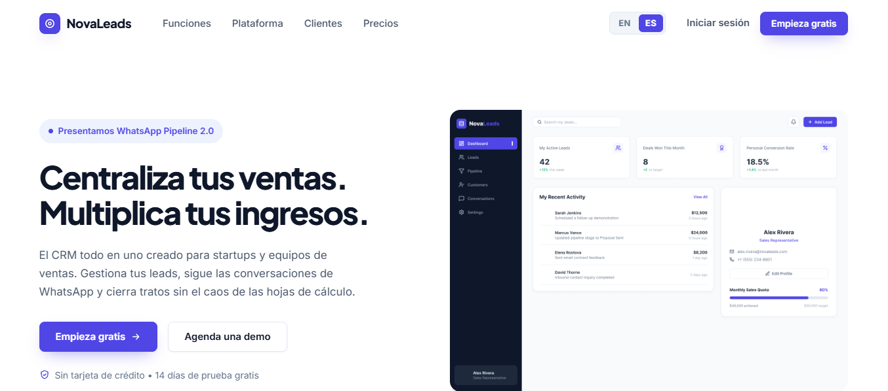
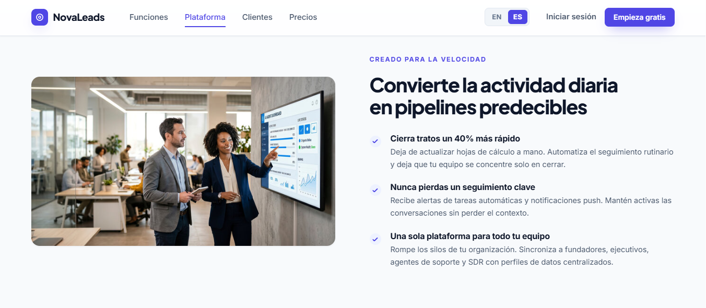

#### 5.2.1.6. Services Documentation Evidence for Sprint Review.
No aplica a primer sprint y desarrollo de Landing Page.

#### 5.2.1.7. Software Deployment Evidence for Sprint Review.
El despliegue de la Landing Page se realizó en el servicio de Github Pages, se seleccionó esta alternativa debido a la rapidez de despliegue y su sencillez, apropiada para una página estática.
Se incluye la evidencia de despliegue del Landing Page en la plataforma Github Pages: [https://202620-1asi0730-8074-novascale.github.io/novascale-website/](https://202620-1asi0730-8074-novascale.github.io/novascale-website/)

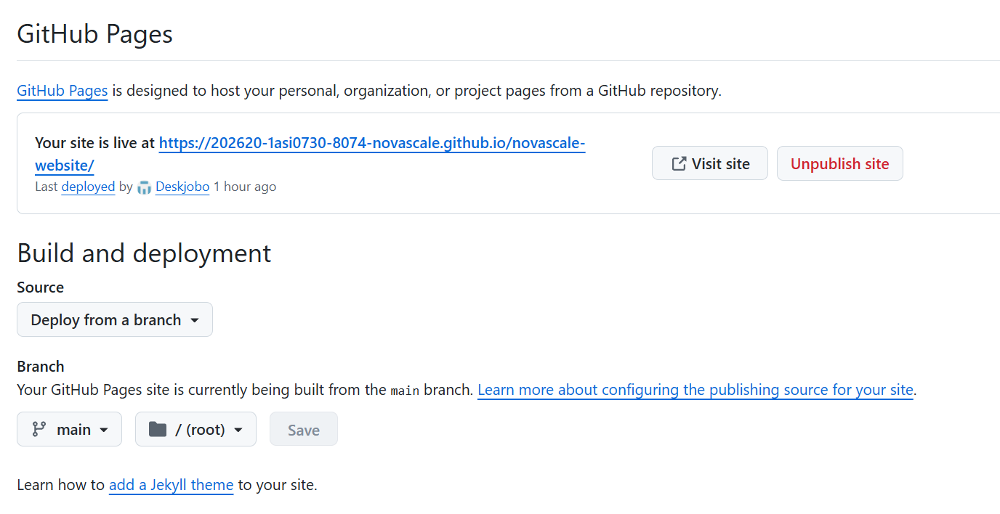
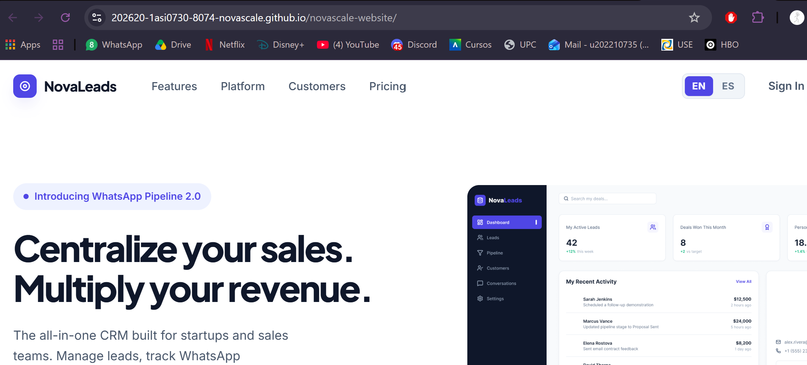

#### 5.2.1.8. Team Collaboration Insights for Sprint Review
Durante el transcurso de este sprint, todos los miembros participaron de forma activa y constante en la creación de las tareas asignadas. A continuación todos los analíticos que nos proporciona Github, en su apartado de Insights, sobre la colaboración del equipo durante el Sprint 1:

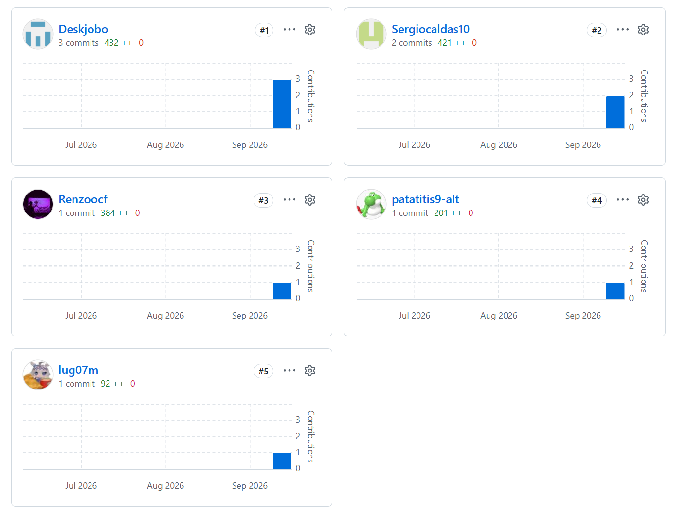

____

### 5.2.2. Sprint 2
En esta sección se registra y explica el avance obtenido durante el segundo ciclo de desarrollo (Sprint 2), abarcando la construcción de los productos de software intermedios y el trabajo colaborativo del equipo. Se incluyen los detalles de planificación, los líderes de cada aspecto, el backlog comprometido y las evidencias de ejecución, documentación y despliegue del trabajo completado.

#### 5.2.2.1. Sprint Planning 2
Durante esta sesión, se seleccionaron las Historias de Usuario más prioritarias del Product Backlog para definir el objetivo central de la iteración. A continuación, se presenta el cuadro resumen con los detalles y acuerdos de esta reunión:

| **Sprint #** | Sprint 2 |
| :--- | :--- |
| **Sprint Planning Background** | |
| **Date** | 2026-09-21 |
| **Time** | 21:00 PM |
| **Location** | Reunión virtual (Google Meet) |
| **Prepared By** | Bottger Salazar, Johan Karl |
| **Attendees (to planning meeting)** | Johan, Renzo, Sergio, Lui, Dario |
| **Sprint 1 Review Summary** | Durante el Sprint 1 el equipo logró completar la primera versión funcional de la Landing Page. Se cumplió el objetivo principal del sprint de habilitar la presencia digital del producto y redactar el tronco del conocimiento relacionado a la solución. |
| **Sprint 1 Retrospective Summary** | La comunicación entre integrantes fue constante y facilitó la integración temprana. Mantener documentación y estándares técnicos actualizados durante el sprint. |
| **Sprint Goal & User Stories** | |
| **Sprint 2 Goal** | **Contexto:** El equipo decidió enfocar el trabajo en el desarrollo del Frontend Web Application.    **Sprint Goal:** *"Our focus is on delivering the first operational version of the NovaLeads Web Application while improving the quality, usability, and stability of artifacts created during Sprint 1.
We believe this delivers a more complete digital experience to administrators and prospective customers by providing the first functional version of the Frontend Web Application.
This will be confirmed when users can access the deployed web application, navigate the improved Landing Page without usability issues, and interact successfully with the first administrative frontend modules in a production-like environment."* |
| **Sprint 2 Velocity** | XX Story Points. (Velocidad estimada basada en la capacidad inicial del equipo para configurar los entornos). |
| **Sum of Story Points** | XX Story Points. |

#### 5.2.2.2. Aspect Leaders and Collaborators

En esta sección se presenta la **Leadership-and-Collaboration Matrix (LACX)**. Esta matriz detalla los líderes (L) y colaboradores (C) para cada aspecto clave del Sprint, asegurando una comunicación clara y una distribución de responsabilidades eficiente para el proyecto. La organización está directamente relacionada con la selección de tareas (*tasks*) que se desarrollarán durante el Sprint.

| Team Member (First Name, Last Name) | GitHub Username | Dashboard | Conversations | Authentication | Leads | QA & Deployment |
| :--- | :--- | :---: | :---: | :---: | :---: | :---: |
| Lui Mathias Gamero Miranda | lug07m | C | L | C | C | C |
| Dario Alberto Romero Vilela | patatitis9-alt | C | C | L | C | C |
| Johan Karl Bottger Salazar | Deskjobo | C | C | C | C | L |
| Sergio Ruben Caldas Garcia | Sergiocaldas10 | L | C | C | C | C |
| Renzo Paul Retuerto Zapata | Renzoocf | C | C | C | L | C |

#### 5.2.2.3. Sprint Backlog 2
Durante el segundo sprint, el equipo se centró en desarrollar la primera versión del Web Application funcional, organizando y distribuyendo tareas en el tablero de Sprint de acuerdo con las habilidades de cada integrante.

##### Sprint 2 - Tareas Asignadas

| User Story | Título | Work-Item / Task | Título | Descripción | Est. (Hrs) | Asignado | Status |
| :--- | :--- | :--- | :--- | :--- | ---: | :--- | :--- |
| HU-01 | Inicio de sesión | T-01 | Implementar inicio de sesión y manejo de sesión | Implementar el formulario de autenticación, integrarlo con el servicio correspondiente y gestionar la respuesta y sesión del usuario. | 8 | Renzo | To Do |
| HU-02 | Gestión de usuarios y permisos | T-02 | Implementar gestión de usuarios y permisos | Implementar la consulta de usuarios vendedores y la modificación y validación de los permisos asignados. | 8 | Dario | To Do |
| HU-03 | Dashboard del dueño | T-03 | Implementar dashboard e indicadores del negocio | Implementar la consulta y presentación de los indicadores generales de leads y ventas mediante los gráficos correspondientes. | 8 | Lui | To Do |
| HU-04 | Dashboard del vendedor | T-04 | Implementar dashboard y validación de indicadores personales | Implementar la consulta y presentación de los indicadores del vendedor autenticado y validar que únicamente pueda consultar sus propios resultados. | 7 | Johan | To Do |
| HU-05 | Visualización de ventas por vendedor | T-05 | Implementar visualización de ventas por vendedor | Implementar la consulta y presentación de las ventas asociadas a cada vendedor para usuarios con permisos de dueño. | 7 | Sergio | To Do |
| HU-06 | Registro de leads | T-06 | Implementar registro y validación de leads | Implementar el formulario de registro de leads, integrarlo con el servicio de creación y validar la información requerida. | 8 | Dario | To Do |
| HU-07 | Filtrado de leads | T-07 | Implementar consulta y filtrado de leads | Implementar la obtención de leads disponibles y su filtrado mediante criterios como estado, vendedor y etiqueta. | 7 | Lui | To Do |
| HU-08 | Cambio de estado de un lead | T-08 | Implementar actualización y validación de estados | Implementar la modificación del estado de un lead y validar los valores permitidos y las respuestas ante valores no válidos. | 7 | Johan | To Do |
| HU-09 | Etiquetado de leads por producto | T-09 | Implementar etiquetado de leads por producto | Implementar la consulta de etiquetas disponibles y la asignación de una o más etiquetas de producto a un lead. | 7 | Sergio | To Do |
| HU-10 | Gestión de etiquetas | T-10 | Implementar gestión de etiquetas | Implementar la creación y edición de etiquetas de productos para usuarios con permisos de gestión, incluyendo la gestión de sus asociaciones con leads. | 8 | Dario | To Do |
| HU-11 | Visualización de contactos | T-11 | Implementar visualización de contactos | Implementar la consulta y presentación de los contactos disponibles según los permisos del usuario. | 6 | Lui | To Do |
| HU-12 | Clasificación de contacto | T-12 | Implementar clasificación de contactos | Implementar la consulta y presentación de la clasificación de cada contacto como lead o cliente. | 5 | Sergio | To Do |
| HU-13 | Edición de información de contacto | T-13 | Implementar edición y validación de contactos | Implementar la modificación de información de contactos autorizados, integrarla con la API y gestionar las validaciones y restricciones de permisos. | 7 | Renzo | To Do |
| HU-14 | Creación automática de contactos | T-14 | Implementar sincronización automática de contactos | Integrar el frontend con la información de contactos generada automáticamente a partir de conversaciones y verificar la correcta sincronización de contactos nuevos y existentes. | 8 | Johan | To Do |
| HU-15 | Visualización de conversaciones | T-15 | Implementar visualización e historial de conversaciones | Implementar la consulta y presentación de las conversaciones disponibles y del historial de mensajes de una conversación seleccionada. | 9 | Lui | To Do |
| HU-16 | Notificación de nuevos mensajes | T-16 | Implementar notificaciones y actualización de conversaciones | Integrar la recepción de notificaciones de nuevos mensajes y actualizar la información de las conversaciones correspondientes. | 7 | Sergio | To Do |
| HU-17 | Temporizador de conversaciones | T-17 | Implementar temporizador de conversaciones | Implementar el cálculo y actualización del tiempo transcurrido desde la recepción de un mensaje pendiente de respuesta. | 6 | Dario | To Do |
| HU-18 | Prioridad automática de conversaciones | T-18 | Implementar prioridad automática de conversaciones | Integrar la información de prioridad calculada y actualizar las conversaciones cuando la prioridad cambia según el umbral definido. | 7 | Johan | To Do |
| HU-19 | Ordenamiento y filtrado de conversaciones | T-19 | Implementar ordenamiento y filtrado de conversaciones | Implementar el ordenamiento y filtrado de conversaciones utilizando criterios de prioridad, etiquetas y vendedor según los permisos disponibles. | 8 | Renzo | To Do |
| HU-20 | Perfil del vendedor | T-20 | Implementar consulta y edición del perfil | Implementar la consulta y modificación de la información autorizada del perfil del vendedor autenticado, incluyendo sus validaciones. | 7 | Sergio | To Do |
| TS-01 | Documentación OpenAPI | T-21 | Configurar y validar documentación OpenAPI | Configurar la documentación automática de los endpoints mediante OpenAPI/Swagger y verificar que recursos, métodos, respuestas y esquemas estén documentados correctamente. | 4 | Renzo | To Do |
| TS-02 | Autenticación de usuarios | T-22 | Implementar y validar API de autenticación | Implementar el endpoint RESTful para autenticar usuarios y generar el token de acceso, validando credenciales, respuestas y códigos HTTP correspondientes. | 8 | Renzo | To Do |
| TS-03 | API de gestión de Leads | T-23 | Implementar y validar API de Leads | Implementar los endpoints RESTful para registrar y consultar leads, incluyendo las validaciones de datos y respuestas HTTP correspondientes. | 10 | Dario | To Do |
| TS-04 | API de gestión de Contactos | T-24 | Implementar y validar API de Contactos | Implementar los endpoints RESTful para consultar y actualizar contactos, incluyendo las validaciones de permisos y respuestas HTTP correspondientes. | 9 | Lui | To Do |
| TS-05 | API de conversaciones | T-25 | Implementar y validar API de conversaciones | Implementar los endpoints RESTful para consultar y gestionar conversaciones e historial de mensajes, incluyendo autorización y respuestas para recursos existentes, inexistentes o no autorizados. | 9 | Johan | To Do |
| TS-06 | API de Dashboard y métricas | T-26 | Implementar y validar API de métricas | Implementar los endpoints RESTful para obtener indicadores de ventas y leads según el rol, validando datos, permisos y períodos sin información. | 9 | Sergio | To Do |
| TS-07 | Manejo de errores y respuestas HTTP | T-27 | Implementar y validar manejo estandarizado de errores | Implementar un mecanismo común para gestionar errores y generar respuestas HTTP consistentes, verificando solicitudes inválidas, recursos inexistentes, accesos no autorizados y errores internos. | 7 | Dario | To Do |

#### 5.2.2.4. Development Evidence for Sprint Review

El principal avance durante el Sprint 2 fue el desarrollo del Frontend Web Application del producto. 
A continuación, se presentan los commits más importantes del Sprint, los cuales muestran el ciclo de vida del proyecto, y toda la información que se usó para el desarrollo.

| Repository | Branch | Commit ID | Message | Body | Commit Date  |
|---|---|---|---|---|---|
| novaleads-webapp | main | 7232b642decc898fccb61cf8274f89b5b18eb295 | feat: Initial frontend commit | - | 6-10-2026 |
| novaleads-webapp | feature/authentication | 62472074af1f6030186ed13777b84aab05444b79 | feat(authentication): add frontend authentication module layers | - | 6-10-2026 |
| novaleads-webapp | feature/conversations | e8bab0c9d6f1303c0d14eaa13a6034dd19201494 | feat(conversations): add frontend conversations | - | 6-10-2026 |
| novaleads-webapp | feature/dashboard | 537b42fda98eafb6f8c599e15c4f4e345b57165a | feat(dashboard): add dashboards and reports | - | 6-10-2026 |
| novaleads-webapp | feature/leads | ed2da282fe144471657364868c7d9519e88ef20c | feat(leads): add frontend leads module | - | 7-10-2026 |

#### 5.2.2.5. Execution Evidence for Sprint Review
Se incluyen capturas detalladas de la ejecución del Frontend Web Application como evidencia.

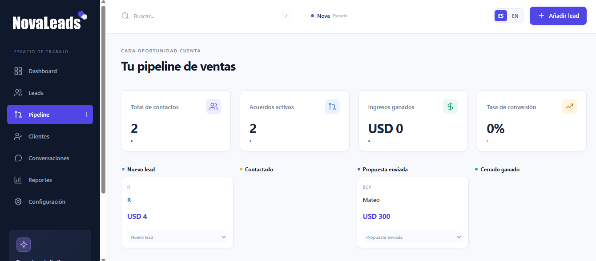
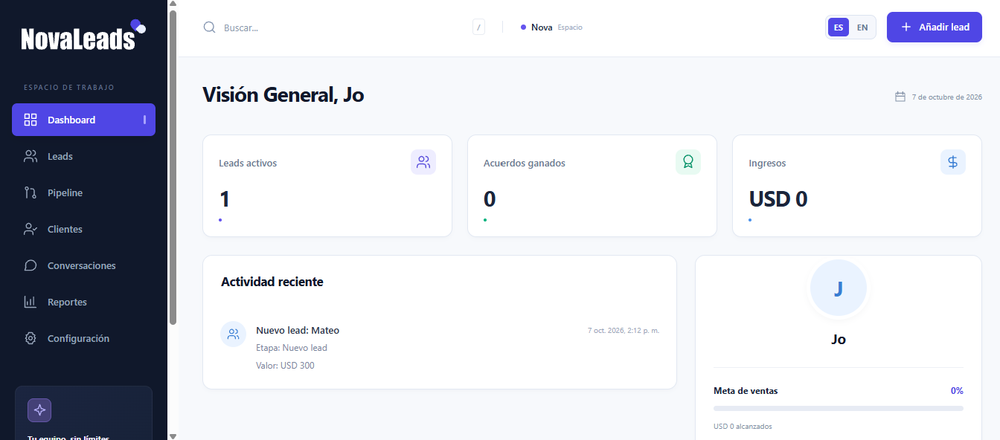
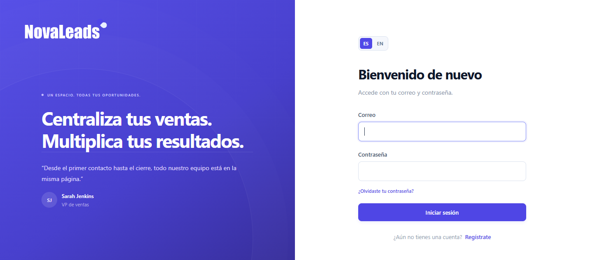

#### 5.2.2.6. Services Documentation Evidence for Sprint Review.
Se incluyen capturas detalladas de los servicios utilizados por el Frontend Web Application, correspondientes a un fakeapi bajo el alcance del sprint.

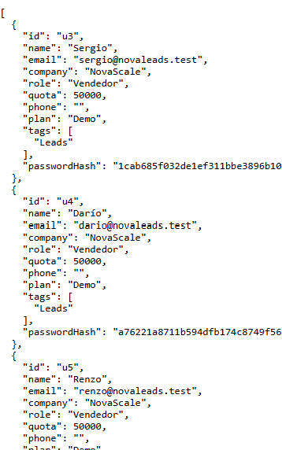

#### 5.2.2.7. Software Deployment Evidence for Sprint Review.

El despliegue del Frontend Web Application se realizó en el servicio de , se seleccionó esta alternativa debido a su rapidez de despliegue y accesibilidad.

Se incluye la evidencia de despliegue: 

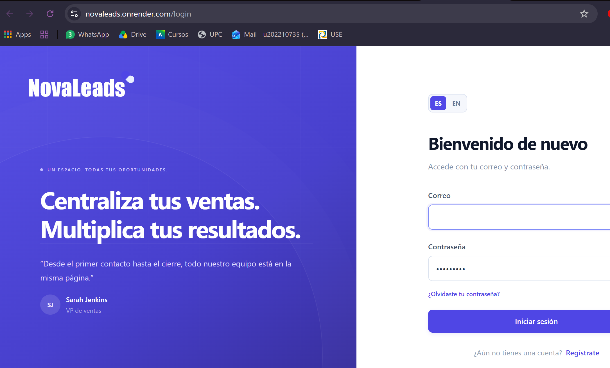
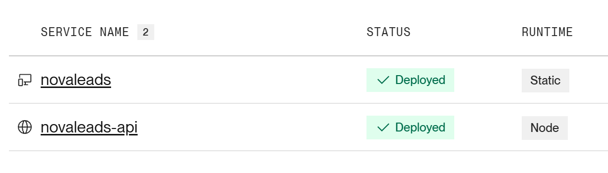

#### 5.2.2.8. Team Collaboration Insights for Sprint Review
Durante el transcurso de este sprint, todos los miembros participaron de forma activa y constante en la creación de las tareas asignadas. A continuación todos los analíticos que nos proporciona Github, en su apartado de Insights, sobre la colaboración del equipo durante el Sprint 2:

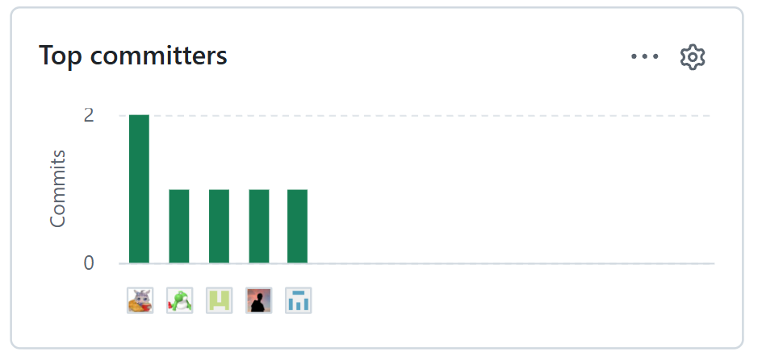
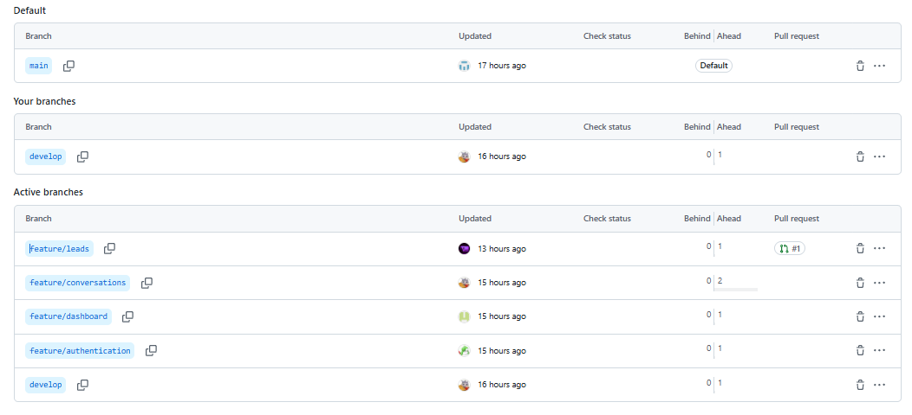
